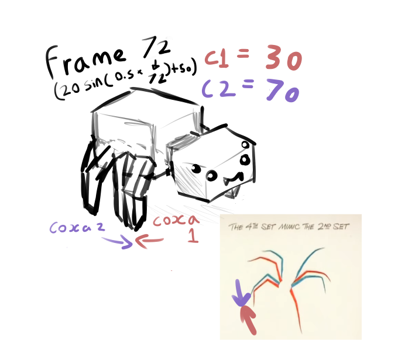
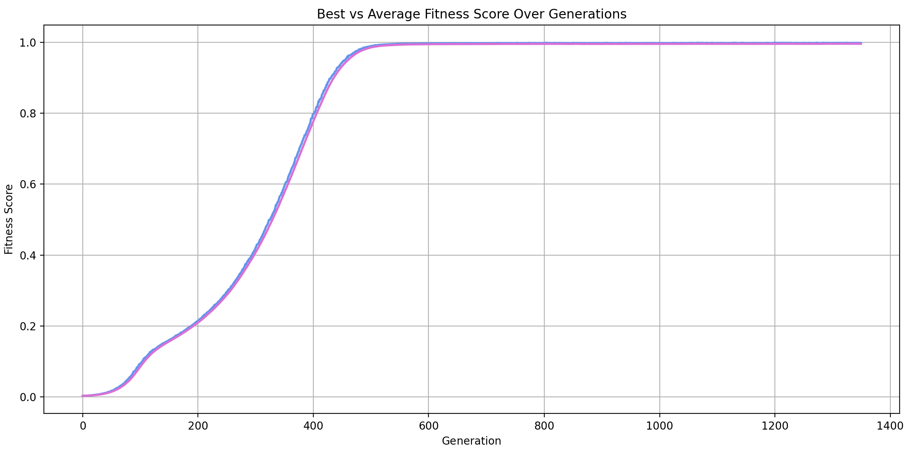
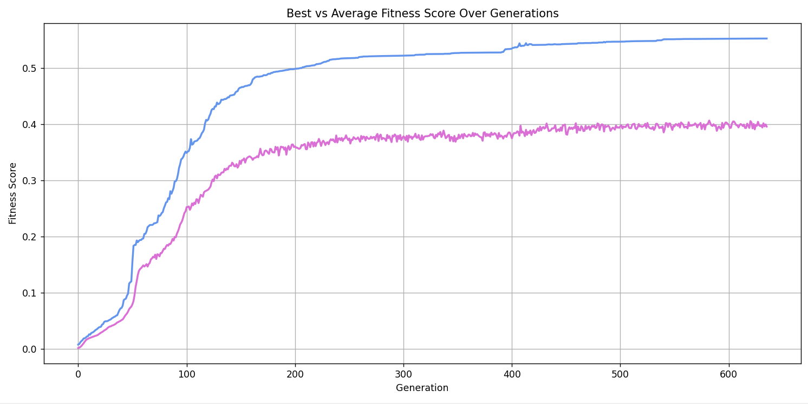

# Chromosome Optimization using Genetic Algorithms

## Table of Contents
1. [Glossary](#glossary)
2. [Overview](#overview)
3. [Solution and Approach](#solution-and-approach)
   - [Initialization](#initialization)
   - [Fitness Function Design](#fitness-function-design)
   - [Selection](#selection)
   - [Reproduction](#reproduction)
   - [Termination](#termination)
4. [Design Decisions and Trade-offs](#design-decisions-and-trade-offs)
5. [Code Structure](#code-structure)
6. [Usage Instructions](#usage-instructions)
7. [Technologies and Libraries](#technologies-and-libraries)
8. [Testing and Validation](#testing-and-validation)
9. [Future Improvements](#future-improvements)

---

## Glossary
| Term | Definition |
|------|-------------|
| **GA (Genetic Algorithm)** | A search heuristic inspired by natural selection, used to optimize solutions. |
| **Gait** | A pattern of limb movement during locomotion. |
| **Chromosome** | Encoded representation of a solution (here, a gait). |
| **Gene** | Individual parameter within a chromosome controlling a specific joint motion. |
| **Fitness Function** | Function used to evaluate how well a solution performs the desired task. |

---

## Overview

The goal of this project is to evolve a **complete gait pattern** — a coordinated walking motion — for a simplified **3D spider model** using a **Genetic Algorithm (GA)**.

### Spider Model
- **8 legs**, each with **3 joints**: coxa, femur, and tibia.  
- Total **24 degrees of freedom**.
- A gait is represented as an **n × 24 matrix**, where *n* is the number of time steps per full walking cycle.

### Genetic Algorithm Process
The GA explores the space of possible walking patterns using the following components:

| Stage | Description |
|--------|-------------|
| **Initialization** | Randomly generates an initial population of gait candidates. |
| **Selection** | Chooses fitter individuals based on performance metrics (stability, speed, efficiency). |
| **Reproduction** | Creates new individuals via crossover and mutation. |
| **Termination** | Ends when improvements plateau or a maximum generation count is reached. |

The focus throughout this implementation is to balance:
- **Biological realism**
- **Computational efficiency**
- **Ease of implementation**

The final objective is a **stable, coordinated, and efficient gait**.

---

## Solution and Approach

### Initialization

Each **individual** in the population represents a complete gait.  
Each gait (chromosome) consists of **8 legs × 3 joints = 24 genes**.

#### Gene Encoding
Each joint’s motion is represented by a **sine-wave function** characterized by five parameters:

| Parameter | Description | Range | Design Rationale |
|------------|-------------|--------|------------------|
| **amplitude** | Amplitude of sine wave controlling joint motion | (-55, 30) | Enables both subtle and large joint swings |
| **period** | Frequency of oscillation | (-5, 5) | Allows fast or slow movement cycles |
| **h_offset** | Phase shift of the sine wave | (-5, 5) | Coordinates timing differences between limbs |
| **negative** | Boolean flag inverting the sine wave | {True, False} | Adds diversity without extra dimensions |
| **v_offset** | Baseline joint angle | (-50, 50) | Adjusts resting joint positions |

#### Representation Rationale
- **Sine-wave encoding** produces smooth, periodic motion aligned with natural walking.
- Ensures **continuous, non-abrupt movement**.
- Compact encoding enables **faster optimization**.

**Trade-off:** Restricts solutions to periodic gaits; may exclude more complex or irregular movements.

---

### Fitness Function Design

#### 1. Overview
The **fitness function** measures how well a gait replicates a desired motion pattern.  
A higher fitness value indicates better gait performance.

#### 2. Evaluation Method
The **Mean Squared Error (MSE)** between predicted joint angles and a pre-generated *target gait* is used:

$$
\text{MSE} = \frac{1}{n} \sum (t - p)^2
$$

Fitness is computed as:

$$
\text{fitness} = \frac{1}{1 + \text{MSE}}
$$

Lower error → higher fitness.

#### 3. Design Rationale

| Aspect | Decision | Rationale | Trade-offs |
|---------|-----------|------------|-------------|
| **Fitness Metric** | Mean Squared Error (MSE) | Penalises large deviations, promoting accuracy | Over-penalises outliers |
| **Error Inversion** | `1 / (1 + MSE)` | Normalises to 0–1 range, suitable for GA | Compresses large error values |
| **Target Gait** | Pre-generated once | Improves efficiency, ensures consistency | May bias evolution |
| **Symmetry** | Evaluate only unique 12 joints | Enforces biological realism, reduces cost | Prevents asymmetric gait discovery |
| **Normalization** | Averaged per joint | Fairness between individuals | Requires fixed gait length |
| **Equal Joint Weighting** | All joints contribute equally | Simplifies implementation | Ignores biomechanical differences |

---

### Selection

**Tournament selection** was chosen for its simplicity and control over selection pressure.

#### Method
1. Randomly select a subset of individuals (`num_selected`).
2. Choose the highest-fitness individual from that group.
3. Repeat until enough parents are selected.

| Decision | Justification |
|-----------|---------------|
| Random subset | Maintains diversity, reduces computation |
| Select fittest | Favors better individuals |
| Adjustable subset size | Controls balance between pressure and diversity |

---

### Reproduction

#### 1. Crossover
A **uniform crossover** is implemented:
- Swaps amplitude and vertical offset, horizontal offset and period, and negative flag values between two parents.
- Produces two offspring per crossover operation.

#### 2. Mutation
Each gene undergoes random variation within local bounds:

| Parameter | Mutation Range | Example |
|------------|----------------|----------|
| **Amplitude, v_offset** | ±10 | `random.uniform(val - 10, val + 10)` |
| **h_offset, period** | ±0.5 | `random.uniform(val - 0.5, val + 0.5)` |
| **negative** | Random boolean toggle | Promotes variation |

This ensures **diversity** and prevents **premature convergence**.

---

### Termination

The algorithm terminates after **600 generations**, balancing **runtime constraints** and **solution quality**.  
This limit was determined empirically based on available computational power.

---

## Design Decisions and Trade-offs

Initial exploration of spider locomotion through video analysis suggested that **sinusoidal motion patterns** closely matched natural spider walking behaviour.  
Early experimentation aimed to replicate this motion directly by assigning fitness values to each **coxa joint** across time, using detailed frame-by-frame evaluations.

---

### Coxa Joint Fitness Evaluation (Initial Approach)

The initial implementation represented each individual as a **2D array** of joint angles:

```
individual = [
    [angle1, angle2, ..., angle24],
    [angle1, angle2, ..., angle24],
    ...
]
```

- Each inner list corresponded to a single frame in the gait sequence.  
- Each frame contained 24 joint angles (8 legs × 3 joints per leg).

#### Extracting Coxa Joints
Coxa joints were located at fixed indices within each frame:

```
coxa_indices = [0, 3, 6, 9, 12, 15, 18, 21]
```

A separate list was created for each coxa to track rotational angles across the gait duration.

#### Fitness Calculation
Each coxa’s fitness was determined by comparing its predicted motion to a **target rotation** generated using a **sine-wave model**:

```
target_rotation = A \sin(Bx) + D
```

Where:
- **A** = half the range of motion  
- **B** = movement frequency  
- **D** = midpoint of the motion range  
- **x** = current frame index

For a coxa range of **30°–70°**,  
\( A = 20 \), \( D = 50 \), producing smooth oscillations between 30° and 70°.


Adjacent legs were programmed to move in opposite phases by negating the input `x` for every even-numbered coxa, creating alternating motion:

```
coxa1_t = 20 * sin(0.5 * 22) + 50 = 30.0002
coxa2_t = 20 * sin(0.5 * -22) + 50 = 69.9998
```


This configuration resulted in realistic alternating leg movement, with even and odd legs moving out of phase.

---

### Computational Limitations

While biologically accurate, this method proved to be **computationally expensive**.  
The algorithm evaluated all **frames**, **joints**, and **individuals** in the population, resulting in an approximate time complexity of:

O(2^P)

where:
- *P* = population size  

As *P* increased, the runtime scaled **exponentially in practice**, creating a severe performance bottleneck and making the approach unsuitable for real-time or large-scale optimisation.

---

### Optimised Sine-Based Encoding (Final Approach)

To address the inefficiency, the design transitioned to a **parameterised sine-based chromosome encoding**.  
Instead of evaluating every frame and joint directly, each gene represented a set of sine-wave parameters that described the entire motion profile of a joint:

| Parameter | Description | Range | Purpose |
|------------|-------------|--------|----------|
| **Amplitude** | Controls joint movement amplitude | (-55, 30) | Enables variation in swing intensity |
| **Period** | Controls oscillation frequency | (-5, 5) | Determines speed of movement |
| **h_offset** | Phase shift of sine wave | (-5, 5) | Synchronises or offsets limbs |
| **negative** | Boolean flag to invert wave | {True, False} | Enables mirrored or opposing motion |
| **v_offset** | Baseline joint position | (-50, 50) | Adjusts resting posture |

This compact representation significantly reduced computational overhead while preserving realistic motion.

---

### Trade-offs

| Aspect | Decision | Benefit | Limitation |
|--------|-----------|----------|-------------|
| **Representation** | Parameterised sine-wave encoding | Smooth, periodic motion; reduced data size | Restricts irregular or non-periodic movement |
| **Fitness Evaluation** | Simplified function using averaged joint performance | Faster convergence, consistent comparisons | Reduced biomechanical granularity |
| **Symmetry Assumption** | Mirrored motion for opposing legs | Ensures stable, coordinated gaits | Limits asymmetric gait discovery |
| **Computation Efficiency** | Transition from frame-based to function-based evaluation | Lower runtime, scalable population size | Slight reduction in fine-grained control |

---

### Summary

The initial frame-based coxa evaluation provided **high biological fidelity** but was limited by **exponential computational cost**.  
The final **sine-wave chromosome encoding** maintained the essential realism of leg movement while enabling **efficient optimisation**, balancing accuracy and performance for practical implementation.

---


---
## Code Structure

```
project/
│
├── ga/   
│   ├── custom_types.py    # Defines the genes of the chromosome
│   ├── fitness_graph.py   # Generate a generation over fitness score and a genration over best individual graph 
│   ├── fitness.py         # Fitness function implementation                 
│   ├── initial_pop.py     # Generates a random initial population
│   ├── main.py            # To run the genetic algorithm
│   ├── output.py          # Generate text file for a target gait solution
│   ├── reproduce.py       # Mutation, Crossover ad Uniform Crossover implementation
│   ├── selection.py       # Roulette and Tournament Implementation
│   └── target_sol.py      # Generate a target solution along with graph for each of the joints in the spider
│
└── requirements.txt
```

## Usage Instructions


Follow these steps to install and run the Genetic Algorithm project.

---

### 1. Install Python

Ensure that **Python 3.10+** is installed on your system.  
You can verify your version using:

```bash
python --version
```

If Python is not installed, download it from the [official Python website](https://www.python.org/downloads/).

---

### 2. Install Required Libraries

Use the following command to install all dependencies:

```bash
pip install numpy matplotlib
```

---

### 3. Run the Genetic Algorithm

Execute the main program to start the Genetic Algorithm and evolve gait patterns:

```bash
python main.py
```

---

### 4. Generate a Target Gait (Without GA)

To generate a **reference gait** without using the Genetic Algorithm:

```bash
python target_sol.py
```

The resulting gait data will be saved for later comparison and testing. The code generates a sol.txt file that contains a 300x24 matrix that can be imported into matlab.

---

## MATLAB Visualization

To visualize the gait in **MATLAB**, use the following script:

```matlab
function plot_spider_pose(angles)
    % plot_spider_pose - Plot a static 3D spider pose based on joint angles
    %
    % Input:
    %   angles: 1x24 vector of joint angles in radians
    %           [theta1_1, theta2_1, theta3_1, ..., theta1_8, theta2_8, theta3_8]
    % Legs are arranged in this configuration: {'L1', 'L2', 'L3', 'L4','R4', 'R3', 'R2', 'R1'}
    
    % Parameters
    n_legs = 8;
    segment_lengths = [1.2, 0.7, 1.0];  % [Coxa, Femur, Tibia]
    a = 1.5; b = 1.0;  % Ellipse axes for body (oval shape)

    % Base angles (L1 front-left to L4 rear-left, R4 rear-right to R1 front-right)
    left_leg_angles = deg2rad([45, 75, 105, 135]);
    right_leg_angles = deg2rad([-135, -105, -75, -45]);
    base_angles = [left_leg_angles, right_leg_angles];

    % Leg labels
    leg_labels = {'L1', 'L2', 'L3', 'L4', 'R4', 'R3', 'R2', 'R1'};

    % Validate input
    if length(angles) ~= n_legs * 3
        error('Input angles must be a 1x24 vector (3 angles per leg for 8 legs).');
    end

    % Setup figure
    figure(1); clf;
    set(gcf, 'Color', '[0,0,0]');
    ax = gca;
    ax.Color = [0.5 0.5 0.5];  
    axis equal;
    grid on;
    hold on;
    xlabel('X'); ylabel('Y'); zlabel('Z');
    %view(45, 45); % window view
    view(90,45);
    xlim([-4 4]); ylim([-4 4]); zlim([-2 2]);

    % Plot body (oval shape)
    t = linspace(0, 2*pi, 100);
    body_x = a * cos(t);
    body_y = b * sin(t);
    plot3(body_x, body_y, zeros(size(t)), 'k-', 'LineWidth', 3);

    % Head marker (front of spider at +X)
    plot3(a + 0.2, 0, 0, 'r^', 'MarkerSize', 10, 'MarkerFaceColor', 'r');

    % Print joint angles for all legs
    fprintf('--- Spider Pose ---\n');
    
    % Loop over legs
    for i = 1:n_legs
        % Indices for this leg's angles
        idx = (i-1)*3 + 1;
        theta1 = angles(idx);
        theta2 = angles(idx+1);
        theta3 = angles(idx+2);

        fprintf('Leg %s: theta1 = %.3f rad, theta2 = %.3f rad, theta3 = %.3f rad\n', ...
            leg_labels{i}, theta1, theta2, theta3);

        % Compute leg base position on body ellipse
        angle = base_angles(i);
        x_base = a * cos(angle);
        y_base = b * sin(angle);
        base_pos = [x_base, y_base, 0];

        % Compute FK for this leg
        [j1, j2, j3, j4] = forward_leg_kinematics2(base_pos, angle, ...
            [theta1, theta2, theta3], segment_lengths);

        % Plot leg segments
        plot3([j1(1), j2(1)], [j1(2), j2(2)], [j1(3), j2(3)], 'k-', 'LineWidth', 2);
        plot3([j2(1), j3(1)], [j2(2), j3(2)], [j2(3), j3(3)], 'b-', 'LineWidth', 2);
        plot3([j3(1), j4(1)], [j3(2), j4(2)], [j3(3), j4(3)], 'r-', 'LineWidth', 2);
        plot3(j4(1), j4(2), j4(3), 'ro', 'MarkerSize', 5, 'MarkerFaceColor', 'r');

        % Label leg
        offset = 0.2;
        label_pos = base_pos + offset * [cos(angle), sin(angle), 0];
        text(label_pos(1), label_pos(2), label_pos(3)+0.05, leg_labels{i}, ...
            'FontSize', 12, 'FontWeight', 'bold');
    end

    hold off;
end

function [j1, j2, j3, j4] = forward_leg_kinematics2(base_pos, base_angle, joint_angles, segment_lengths)
    % base_pos: [x,y,z] position of leg base on body
    % base_angle: angle around body ellipse where leg base is located (radians)
    % joint_angles: [theta1, theta2, theta3] joint angles for the leg in radians
    % segment_lengths: [coxa, femur, tibia] lengths of leg segments
    
    % Unpack joint angles
    theta1 = joint_angles(1); % Coxa yaw (rotation about vertical axis)
    theta2 = joint_angles(2); % Femur pitch
    theta3 = joint_angles(3); % Tibia pitch
    
    % Unpack segment lengths
    L1 = segment_lengths(1);  % Coxa length
    L2 = segment_lengths(2);  % Femur length
    L3 = segment_lengths(3);  % Tibia length
    
    % Joint 1: leg base on body
    j1 = base_pos;  % starting point
    
    % --- Compute Coxa direction with elevation ---
    coxa_elevation = deg2rad(30);  % fixed 30 degree upward pitch for coxa
    
    % Horizontal direction of coxa in XY plane based on base_angle + theta1
    coxa_horiz_dir = [cos(base_angle + theta1), sin(base_angle + theta1), 0];
    
    % Rotation axis for pitch up: perpendicular to coxa horizontal direction in XY plane
    rot_axis = cross(coxa_horiz_dir, [0 0 1]);
    
    % Rotation matrix around rot_axis by coxa_elevation
    R = axis_angle_rotation_matrix(rot_axis, coxa_elevation);
    
    % Rotate horizontal coxa direction upward
    coxa_dir = (R * coxa_horiz_dir')';
    
    % Joint 2 position: end of coxa segment
    j2 = j1 + L1 * coxa_dir;
    
    % --- Femur rotation ---
    % Femur pitch is relative to coxa direction, rotate in plane defined by coxa_dir
    % To simplify, rotate femur around axis perpendicular to coxa_dir and Z
    
    % Define femur rotation axis (perpendicular to coxa_dir and vertical axis)
    femur_rot_axis = cross(coxa_dir, [0 0 1]);
    femur_rot_axis = femur_rot_axis / norm(femur_rot_axis);
    
    % Femur direction vector starts aligned with coxa_dir
    femur_dir = rotate_vector(coxa_dir, femur_rot_axis, theta2);
    
    % Joint 3 position: end of femur segment
    j3 = j2 + L2 * femur_dir;
    
    % --- Tibia rotation ---
    % Tibia pitch is relative to femur direction
    % Rotate tibia around axis perpendicular to femur_dir and vertical axis
    
    tibia_rot_axis = cross(femur_dir, [0 0 1]);
    tibia_rot_axis = tibia_rot_axis / norm(tibia_rot_axis);
    
    % Tibia direction vector
    tibia_dir = rotate_vector(femur_dir, tibia_rot_axis, theta3);
    
    % Joint 4 position: end of tibia segment (foot)
    j4 = j3 + L3 * tibia_dir;
end

% --- Helper function: axis-angle rotation matrix ---
function R = axis_angle_rotation_matrix(axis, angle)
    axis = axis / norm(axis);
    x = axis(1); y = axis(2); z = axis(3);
    c = cos(angle);
    s = sin(angle);
    C = 1 - c;
    R = [ x*x*C + c,   x*y*C - z*s, x*z*C + y*s;
          y*x*C + z*s, y*y*C + c,   y*z*C - x*s;
          z*x*C - y*s, z*y*C + x*s, z*z*C + c ];
end

% --- Helper function: rotate a vector around an axis by an angle ---
function v_rot = rotate_vector(v, axis, angle)
    R = axis_angle_rotation_matrix(axis, angle);
    v_rot = (R * v')';
end

v = readmatrix('ga/sol.txt');
A = deg2rad(v);

for idx = 1:size(v,1)
    plot_spider_pose(A(idx,:));
    pause(0.001);
end
```

**Explanation:**
- `readmatrix()` loads the gait data from `sol.txt`.  
- `deg2rad()` converts joint angles to radians.  
- The loop visualizes each time step, animating the spider’s movement.

---

## Technologies and Libraries

| Library | Purpose |
|----------|----------|
| [NumPy](https://numpy.org/) | Numerical computation and matrix operations |
| [Matplotlib (pyplot)](https://matplotlib.org/) | Visualization and plotting of gait data |
| **random** | Randomized initialization and mutation processes |
| **math** | Trigonometric and mathematical calculations for gait motion |

---

## Testing and Validation

| Test Type | Description |
|------------|-------------|
| **Convergence Tracking** | Recorded and plotted fitness values across generations to monitor improvement |
| **Visual Verification** | Assessed gait smoothness and motion stability via MATLAB visualization |
| **Parameter Sensitivity** | Tested robustness by varying mutation rates and population sizes |

## Convergence Tracking




## Visual Verification


---

## Future Improvements

1. Introduce **weighted joint importance** to emphasize load-bearing joints.   
2. Allow **multiple target gaits** to evolve more diverse movement styles.  
3. Replace fixed generation limits with **adaptive convergence detection**.  
4. Combine the Genetic Algorithm with **reinforcement learning** for enhanced adaptability.

---

## References

1. **YouTube – Spider Locomotion Analysis**  
   [https://www.youtube.com/watch?v=NV8a4QJfHVg](https://www.youtube.com/watch?v=NV8a4QJfHVg)

2. **YouTube – Robot Spider Walking Mechanics**  
   [https://www.youtube.com/watch?v=GtHzpX0FCFY](https://www.youtube.com/watch?v=GtHzpX0FCFY)

3. **IEEE Xplore – Evolutionary Gait Generation for Multi-Legged Robots**  
   [https://ieeexplore.ieee.org/document/4650677](https://ieeexplore.ieee.org/document/4650677)

4. **PubMed Central – Genetic Algorithm Applications in Robotics**  
   [https://pmc.ncbi.nlm.nih.gov/articles/PMC6935789/](https://pmc.ncbi.nlm.nih.gov/articles/PMC6935789/)

---


