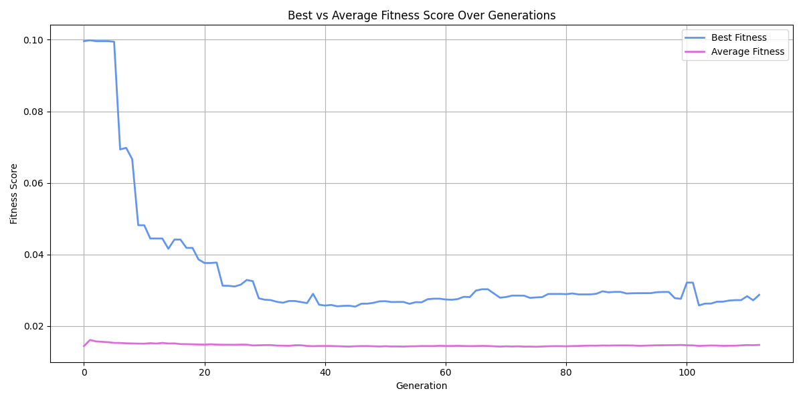
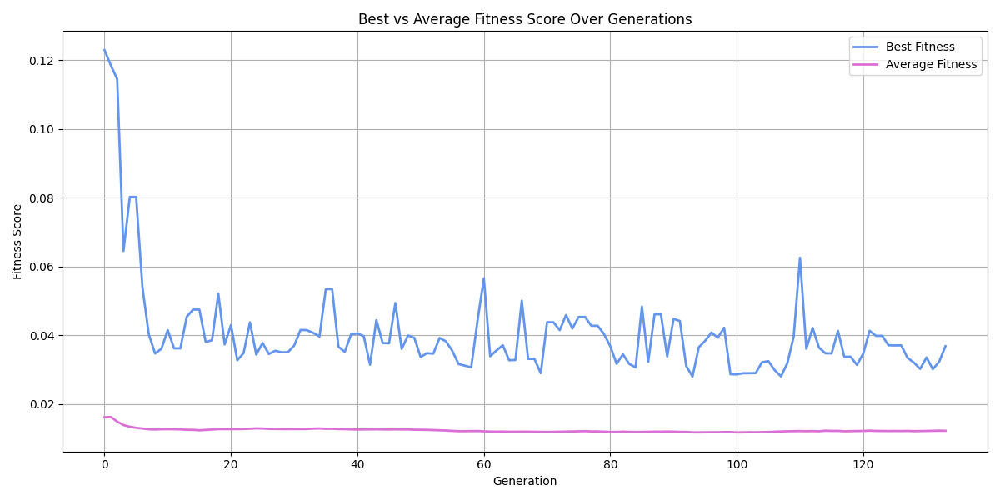
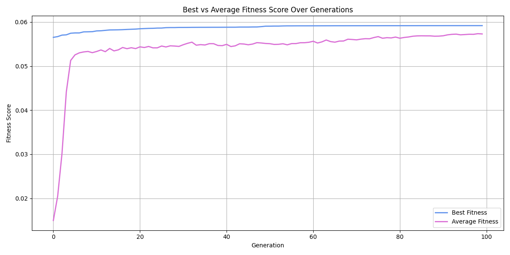
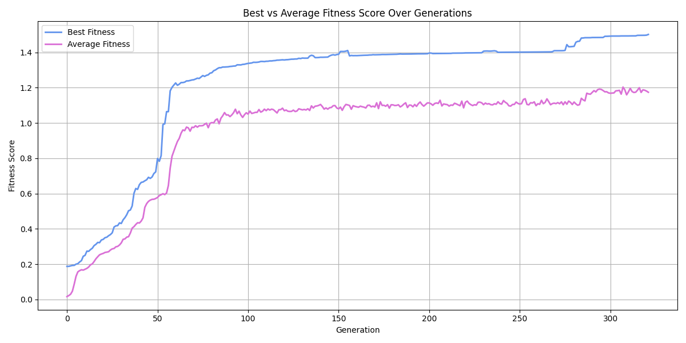
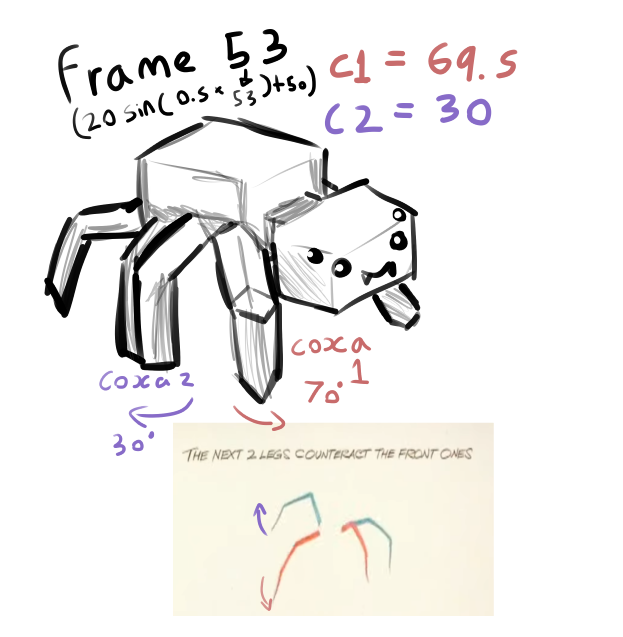
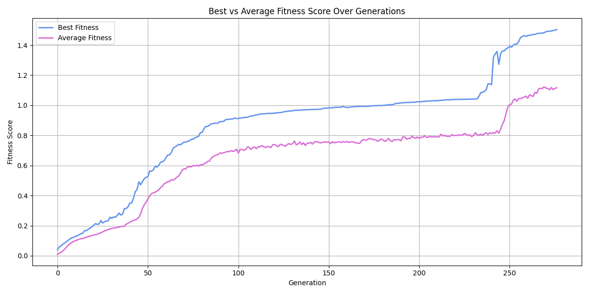
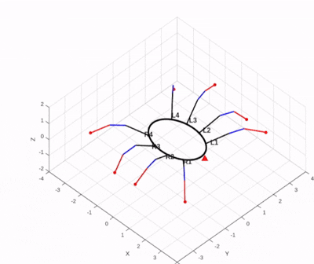

# Chromosome Optimisation using Genetic Algorithms

## Table of Contents
1. [Definitions](#definitions)
2. [Overview](#overview)
3. [Solution and Approach](#solution-and-approach)
   - [Initialisation](#initialisation)
   - [Fitness Function Design](#fitness-function-design)
   - [Comparisons of combinations of Selection and Crossover techniques](#comparisons-of-combinations-of-selection-and-crossover-techniques)
   - [Selection](#selection)
   - [Reproduction](#reproduction)
   - [Termination](#termination)
4. [Design Decisions and Trade-offs](#design-decisions-and-trade-offs)
5. [Code Structure](#code-structure)
6. [Usage Instructions](#usage-instructions)
7. [Technologies and Libraries](#technologies-and-libraries)
8. [Testing and Validation](#testing-and-validation)
9. [Future Improvements](#future-improvements)

---

## Definitions
| Term | Definition |
|------|-------------|
| **GA (Genetic Algorithm)** | A set of algorithms that are used to optimise solutions using methods that are inspired by evolutionary biology. |
| **Gait** | A pattern of limb movement whilst walking. |
| **Chromosome** | A tuple encapsulating sine wave parameters. |
| **Gene** | An individual parameter within a chromosome that controls a specific aspect of a joint movement. 

- **Amplitude** *(float)*: Maximum rotational displacement of a joint
- **Period** *(float)*: Controls the speed of the gait cycle
- **H_offset** *(float)*: Horizontal phase offset of limb movement
- **Negative** *(bool)*: Inverts rotation along the x-axis, allowing limbs to move independently rather than in unison
- **V_offset** *(float)*: Angular offset applied to the femur joints
- **Fitness Function**: Function used to evaluate how well a solution performs the desired task.

---

## Overview
The goal of this part is to evolve a gait pattern for the provided spider 3D model, using a Genetic algorithm (GA)

### Spider Model
The spider model has 8 legs, each with 3 joints; coxa, femur and tibia. This totals for 24 degrees of freedom.
A gait is represented as an **n × 24 matrix**, where *n* is the number of time steps per full walking cycle.

### Genetic Algorithm Process
The GA explores the space of possible walking patterns using the following components:

| Stage | Description |
|--------|-------------|
| **Initialisation** | Randomly generates an initial population of gait candidates. |
| **Selection** | Chooses fitter individuals based on performance metrics. |
| **Reproduction** | Creates new individuals through crossover and mutation. |
| **Termination** | Ends when improvements plateau or a maximum generation count is reached. |

The focus throughout this implementation is to balance 2 goals: Biological realism and computational efficiency

## Solution and Approach

### Initialisation

Each **individual** in the population represents a complete gait.  
Each chromosome consists of five parameters (amp, p, offset, etc.) that control the oscillation of a joint. For each limb, there are 3 joints. Finally, there are 2 unique limbs per side on this spider. So in total **5x3x2x2 = 60 genes**

Each side (left and right) has two unique sine waves per joint, for a total of six. The pattern on each side follows an A, B, A, B sequence, meaning the front legs follow the 3rd legs and the 2nd legs follow the back legs.

#### Gene Encoding
Each joint’s motion is represented by a **sine-wave function** characterised by five parameters:

| Parameter | Description | Range | Design Rationale |
|------------|-------------|--------|------------------|
| **amplitude** | The amplitude of the sine wave controlling joint motion is currently shared across the coxa, tibia, and femur. In [`target_sol.py`](https://github.com/SpindlySpider/UoP-AI-CW/blob/main/ga/target_sol.py), this parameter is separated into two independent amplitudes: one dedicated to the coxa and another applied to both the tibia and femur. | (-55, 30) | Enables both subtle and large joint swings |
| **period** | Frequency of oscillation | (-5, 5) | Allows fast or slow movement cycles |
| **h_offset** | Phase shift of the sine wave | (-5, 5) | Coordinates timing differences between limbs |
| **negative** | Boolean flag inverting the sine wave | {True, False} | Adds diversity without extra dimensions |
| **v_offset** | Baseline joint angle | (-50, 50) | Adjusts resting joint positions |

The wide range of possible values for these parameters creates a high-dimensional search space, providing the Genetic Algorithm (GA) with a large search space to be explored.

#### Representation Rationale
The sine wave parameter encoding, produces smooth oscillating motions, which can be aligned with natural walking patterns. It additionally ensures that the gait continually moves and values per time step are not too far apart for each joint. Finally due to there being 60 genes for an individual it is much more computationally efficient compared to 24x300.

However this approach does have the trade off of:
Restricting the solution of the GA to a specific periodic gait predefined. Restricting gaits with more complex and irregular movements.

---

### Fitness Function Design

#### Overview
The **fitness function** measures how well a gait matches the desired solution.
A higher fitness value indicates better gait performance.

#### Evaluation Method
The **Mean Squared Error (MSE)** between predicted joint angles and a pre-generated *target gait* is used:

$$
\text{MSE} = \frac{1}{n} \sum (t - p)^2
$$

Fitness is calculated using the equation:

$$
\text{fitness} = \frac{1}{1 + \text{MSE}}
$$

The smaller the error, the higher the fitness score.

#### Design Rationale

| Aspect | Decision | Rationale | Trade-offs |
|---------|-----------|------------|-------------|
| **Fitness Metric** | Mean Squared Error (MSE) | Penalises large deviations, promoting accuracy | Over-penalises outliers |
| **Error Inversion** | `1 / (1 + MSE)` | Normalises to 0–1 range, suitable for GA | Compresses large error values |
| **Target Gait** | Pre-generated once | Improves efficiency, ensures consistency | May bias evolution |
| **Symmetry** | Evaluate only unique 12 joints | Enforces biological realism, reduces cost | Prevents asymmetric gait discovery |
| **Normalisation** | Averaged per joint | Fairness between individuals | Requires fixed gait length |
| **Equal Joint Weighting** | All joints contribute equally | Simplifies implementation | Ignores biomechanical differences |

---

#### Code

[ga/`fitness.py`](https://github.com/SpindlySpider/UoP-AI-CW/blob/main/ga/fitness.py)

```python
from custom_types import Individual, Gait
import math
import target_sol

class Fitness:
    """
    A class to evaluate the fitness of an individual gait using a target gait as a reference.

    The fitness is calculated based on the Mean Squared Error (MSE) between the generated
    gait (from the individual's chromosomes) and a target gait solution. Lower error means
    a higher fitness score.

    Attributes:
        target_individual (Gait): A reference gait used for comparison.
        gait_length (int): The number of time steps representing one gait cycle.
    """

    def __init__(self, gait_length: int):
        """
        Initialise the fitness evaluator.

        Parameters:
            gait_length (int): The number of time steps in the gait cycle.

        Notes:
            The target gait is generated once during initialisation to avoid recomputation.
        """
        self.target_individual = target_sol.random_sol(gait_length)
        self.gait_length = gait_length

    def get_fitness(self, individual: Individual) -> float:
        """
        Compute the fitness of a given individual by comparing it to the target gait.

        The comparison uses Mean Squared Error (MSE) for each joint (coxa, femur, tibia),
        normalised and inverted so that higher fitness corresponds to lower error.

        Parameters:
            individual (Individual): The individual whose gait is to be evaluated.

        Returns:
            float: The total fitness value for the individual. Higher is better.
        """
        # Track cumulative error per joint type
        fit_dict: dict[str, float] = {"coxa": 0, "femur": 0, "tibia": 0}
        joint_names = ["coxa", "femur", "tibia"]

        # Generate gait (predicted joint movements) for this individual
        gait = gen_gait(individual, self.gait_length)

        # Limit comparison to the first 50 time steps for efficiency
        length = self.gait_length if self.gait_length < 50 else 50

        for chromosome_idx in range(length):
            # Evaluate left side joints (indices 0–5)
            for gene_idx in range(6):
                joint = joint_names[gene_idx % 3]
                target_val = self.target_individual[chromosome_idx][gene_idx]
                pred_val = gait[chromosome_idx][gene_idx]
                err = (target_val - pred_val) ** 2
                fit_dict[joint] += err

            # Evaluate right side joints (indices 13–18, mirror pattern)
            for gene_idx in range(13, 19):
                joint = joint_names[gene_idx % 3]
                target_val = self.target_individual[chromosome_idx][gene_idx]
                pred_val = gait[chromosome_idx][gene_idx]
                err = (target_val - pred_val) ** 2
                fit_dict[joint] += err

        # Normalise errors and invert (1 / (1 + MSE)) for fitness
        for joint in joint_names:
            j = fit_dict[joint]
            j = (j / (4 * self.gait_length))  # Average per joint
            j = 1 / (1 + j)                   # Invert to make higher = better
            fit_dict[joint] = j

        # Combine fitness across all joint types equally
        fit_val = fit_dict["coxa"] + fit_dict["femur"] + fit_dict["tibia"]

        return fit_val


def gen_gait(individual: Individual, gait_length: int) -> Gait:
    """
    Generate a gait sequence from an individual's chromosomes.

    Each chromosome defines a sine wave controlling a joint's motion.
    The gait sequence is built by evaluating these sine functions over time.

    Parameters:
        individual (Individual): The list of chromosomes defining the gait.
        gait_length (int): The number of time steps to simulate.

    Returns:
        Gait: A list of lists containing predicted joint angles over time.
    """
    gait: Gait = []

    for idx in range(gait_length):
        gait.append([])
        prev_limb = []

        for chromosome in individual:
            amplitude, period, offset, neg, v_offset = chromosome

            # Compute sine value for current timestep
            sin_val: float = (period * idx) + offset
            sin_val = -sin_val if neg else sin_val
            predict: float = (amplitude * math.sin(sin_val)) + v_offset

            # Clamp joint angle to minimum threshold
            predict = predict if predict > -50 else -50

            prev_limb.append(predict)
            gait[idx].append(predict)

            # Duplicate values for symmetric legs (6 joints mirrored)
            if len(prev_limb) == 6:
                gait[idx] = gait[idx] + prev_limb[:3] + prev_limb[3:]
                prev_limb = []

    return gait
```

### Comparisons of combinations of Selection and Crossover techniques 

To identify the most effective combination of **selection** algorithm and **crossover** algorithm, several controlled tests were conducted. All other algorithm parameters were kept constant to ensure that any performance differences were solely due to the combinations of **selection** and **crossover** that were being used for comparison. The following code was use for the test:
```python
import sys

from fitness import Fitness
import selection as selection
import reproduce as reproduce
import output as output 
import matplotlib.pyplot as plt
from custom_types import *


# define the set of frames in the gait cycle
gait_length:int = 300
# define search space
population_size:int = 3000
mutation_rate:float = 0.025
crossover_rate:float = 0.7
# define fitness target score
fitness_score_target:float = 1.5


def plot_fitness_graph(fitness_values, avg_fitness_values, generations, graph_title):
    '''
    Plots the fitness graph showing best and average fitness scores over generations.
    Parameters:
    fitness_values (list): List of best fitness scores for each generation.
    avg_fitness_values (list): List of average fitness scores for each generation.
    generations (int): Total number of generations.
    '''
    # Create a new figure for the plot
    plt.figure(figsize=(12, 6))
    # Plot the best fitness values
    plt.plot(range(generations), fitness_values, color='cornflowerblue', linewidth=2, label='Best Fitness')
    # Plot the average fitness values
    plt.plot(range(generations), avg_fitness_values, color='orchid', linewidth = 2, label='Average Fitness')
    # Add title to the plot
    plt.title("Best vs Average Fitness Score Over Generations")
    # label x-axis
    plt.xlabel("Generation")
    # label y-axis
    plt.ylabel("Fitness Score")
    # Show grid
    plt.grid(True)
    # Show legend
    plt.legend()
    # Show tight layout
    plt.tight_layout()
    # Save figure (must be before plt.show())
    plt.savefig(graph_title)
    plt.show()


def gen_individual(period: Period, h_offset: H_offset, amplitude: Amplitude, negative: Negative, v_offset: V_offset) -> Individual:

    individual: Individual = []

    for _ in range(12):
        # Each chromosome encodes a sine wave controlling joint motion
        # 8 legs × 3 joints = 24 joints, but symmetric legs share parameters → 12 unique sets.

        # Define search space boundaries for each parameter.
        period: Period = period        # Frequency of joint oscillation
        h_offset: H_offset = h_offset      # Phase shift (horizontal offset)
        amplitude: Amplitude = amplitude  # Amplitude of joint movement
        negative: Negative = negative # Whether to invert sine wave motion
        v_offset: V_offset = v_offset    # Vertical offset (baseline joint position)
        # A chromosome is defined as a tuple of sine wave parameters.
        chromosome: Chromosome = (amplitude, period, h_offset, negative, v_offset)
        individual.append(chromosome)

    return individual


def gen_population(max_pop: int) -> Population:
    """
    Generate the initial population for the genetic algorithm.

    Parameters:
        max_pop (int): The total number of individuals to create in the initial population.
        gait_length (int): The number of time steps in one gait cycle (passed to gen_individual).

    Returns:
        Population: A list of individuals, where each individual is a list of chromosomes.
    """
    population: Population = []

    for i in range(max_pop):
        population.append(gen_individual(-5 + (0.003 * i), -5 + (0.003 * i), -55 -5 + (0.02 * i), True, -50 + (0.03 * i)))

    return population


def test_cross_selection(gait_length:int = gait_length,population_size:int = population_size,mutation_rate:float = mutation_rate, crossover_rate:float = crossover_rate,fitness_score_target:float = fitness_score_target, crossover_method = reproduce.uniform_crossover, selection_method = selection.tournament) -> None:
    '''
    Main file to run genetic algorithm for gait generation of the spider.
    The Genetic algorithm evolves the population over a defined set number of generations and outputs the best solution found.
    Draws a fitness graph at the end showing best and average fitness scores over generations.
    A max population size and gait length can be defined to control the search space.
    '''

    population: Population = gen_population(population_size)
    # create fitness object using the class from fitness module(python file)
    fit: Fitness = Fitness(gait_length)
    # lists to store the best fitness scores over generations for plotting
    fitness_over_time: list[float] = []
    # list to store average fitness scores over generations for plotting
    avg_fitness_over_time: list[float] = []
    # run GA for set number of generations defined above
    gen:int = 0
    current_best_fitness:float = 0.0
    while current_best_fitness < fitness_score_target:
        # stores the fitness score of each individual in the population
        # stores the index of the best individual in current population
        fitness_list: list[float] = []  
        # generate fitness list
        best_idx: int = 0
        # go through each individual in the population and get the fitness score 
        for individual in population:
            # calculate fitness score of the current individual using the method from fitness class
            individual_fitness: float = fit.get_fitness(individual)
            # append fitness score to list
            fitness_list.append(individual_fitness)
        # get index of best individual in current population
        best_idx: int = fitness_list.index(max(fitness_list))
        # update current best fitness
        current_best_fitness: float = fitness_list[best_idx]
        # print information about current generation
        gen += 1
        print("generation:",gen,"| best index: ",best_idx, "| fitness: ",fitness_list[best_idx])

        # calculate average fitness for current generation
        avg_fitness: float = sum(fitness_list) / len(fitness_list)
        # append best and average fitness to their respective lists
        fitness_over_time.append(fitness_list[best_idx])
        avg_fitness_over_time.append(avg_fitness)

        if len(fitness_over_time) >= 100:
            last_100_avg: float = sum(fitness_over_time[-100:]) / 100
            if round(last_100_avg , 3) == round(current_best_fitness, 3):
                print("Fitness target consistently met over 100 generations with the best fitness score being:", current_best_fitness)
                break

        # select individuals for next generation using the functions from selection module(python file)
        population = selection_method(population,fitness_list,10)
        # perform crossover and mutation to generate new individuals using functions from reproduce module(python file)
        population = crossover_method(population,gait_length,crossover_rate)
        population = reproduce.mutate(population,mutation_rate)


    # plot fitness graph using the function from fitness_graph module(python file)
    print("Generating fitness graph...")
    print(f"{crossover_method.__name__}-crossover_{selection_method.__name__}-selection_fitness-over-{gen}-gens.png")
    plot_fitness_graph(fitness_over_time, avg_fitness_over_time, gen,f"{crossover_method.__name__}-crossover_{selection_method.__name__}-selection_fitness-over-{gen}-gens.png")


if __name__ == "__main__":
    test_cross_selection(crossover_method = reproduce.crossover,selection_method = selection.roulette)
    test_cross_selection(crossover_method = reproduce.uniform_crossover,selection_method = selection.roulette)
    test_cross_selection(crossover_method = reproduce.crossover,selection_method = selection.tournament)
    test_cross_selection(crossover_method = reproduce.uniform_crossover,selection_method = selection.tournament)
```

### Results

<p align="center">
  
</p>

**Normal crossover + roulette selection**  
- **Generations:** 113  
- **Best fitness:** 0.028706286808067798  
- The best individual’s fitness remained static for several generations, then dropped sharply before settling at approximately **0.0287** for the final ~100 generations. The average fitness increased slightly at the beginning but then remained essentially constant with negligible variation.

<p align="center">
  
</p>

**Uniform crossover + roulette selection**  
- **Generations:** 134  
- **Best fitness:** 0.036777258899552204  
- The best fitness started around **0.1**, fell steeply, and then fluctuated significantly across generations before stabilising near **0.037** in the final ~100 generations. The average fitness showed virtually no change throughout the test.

<p align="center">
  
</p>

**Normal crossover + tournament selection**  
- **Generations:** 100  
- **Best fitness:** 0.059186057193700965  
- The best fitness remained relatively stable across the generations, settling around **0.059** in the final ~100 generations. The average fitness initially rose sharply before levelling off.

<p align="center">
  
</p>

**Uniform crossover + tournament selection**  
- **Generations:** 322  
- **Best fitness:** 1.5017300943963494  
- The only combination that successfully reached the target fitness score shows a rapid improvement early on, followed by steady, progressive increases. After a brief period of stagnation, a small spike occurs, and the algorithm gradually converges to the best-individual target fitness. The average fitness follows the same overall pattern.

**Overall conclusion:**  
Across all tests, the combination of **uniform crossover** and **tournament selection** consistently produced the strongest results, achieving the highest best-individual fitness values.

### Selection

### Selection Methods

Initially, both **tournament selection** and **roulette wheel selection** were implemented to evaluate each option.   
It was ultimately decided that **Tournament selection** would be used due to its simplicity, making it a reliable and efficient method for guiding the evolutionary process.


#### Method
1. Randomly select a subset of individuals (`num_selected`).
2. Choose the highest-fitness individual from that group.
3. Repeat until enough parents are selected.

| Decision | Justification |
|-----------|---------------|
| Random subset | Maintains diversity, reduces computation |
| Select fittest | Favors better individuals |
| Adjustable subset size | Controls balance between pressure and diversity |

---
#### Code
[ga/`selection.py`](https://github.com/SpindlySpider/UoP-AI-CW/blob/main/ga/selection.py)

```python
def tournament(population: Population, fitness: list[float], num_selected: int) -> Population:
    """
    Selects individuals using tournament selection.

    For each parent to select, 'num_selected' individuals are randomly sampled
    from the population, and the one with the highest fitness is chosen.

    Parameters
    ----------
    population : Population
        The current population of individuals.
    fitness : list[float]
        List of fitness values corresponding to each individual.
    num_selected : int
        Number of individuals to compare in each tournament.

    Returns
    -------
    Population
        A new list of selected individuals of the same size as the input population.
    """
    selected_parents: Population = []
    pop_size: int = len(population)

    for _ in range(pop_size):
        # Randomly pick individuals for the tournament
        selected_idx = [random.randint(0, pop_size - 1) for _ in range(num_selected)]

        # Choose the one with the highest fitness
        best_idx = max(selected_idx, key=lambda i: fitness[i])
        selected_parents.append(population[best_idx])

    return selected_parents

```

### Reproduction

#### Crossover
Both **normal crossover** and **uniform crossover** were implemented and tested for performance. **Uniform crossover** was chosen as it consistently produced more diverse offspring, which  resulted in faster convergence and improved optimisation quality.

**Uniform crossover** randomly swaps  corresponding **amplitude**, **vertical offset**, **horizontal offset** and **period**, as well as **negative flag** values between two parents and generates **two offspring** per crossover operation.

During the crossover process, all individuals selected from the tournament go into a list. From there, each pair has a 0.7 chance of going through uniform crossover; if they are not selected, they go directly into the new population.

#### Code

[ga/`reproduce.py`](https://github.com/SpindlySpider/UoP-AI-CW/blob/main/ga/reproduce.py)

```python
def uniform_crossover(parents:Population,gait_length:int,crossover_rate:float) -> Population:
    '''
    Performs uniform crossover on a population of individuals. 
    Parameters:
        parents (Population): The population of individuals to perform crossover on.
        gait_length (int): The number of frames in the gait cycle.
        crossover_rate (float): The probability of performing crossover on a pair of parents.
    Returns:
        Population: The new population of individuals after crossover.
    '''
    # explanation found here: 
    # - https://en.wikipedia.org/wiki/Crossover_(evolutionary_algorithm)
    # - https://www.geeksforgeeks.org/machine-learning/crossover-in-genetic-algorithm/
    # size of the population
    pop_size: int = len(parents)
    # list to hold new offspring
    offspring: Population = []
    gene_chance = 0.5
    # check if odd number of parents
    if pop_size % 2 != 0:
        # ensure even num of parents
        offspring.append(parents.pop())
        pop_size -= 1

    # perform crossover in pairs
    for i in range(0, pop_size-1,2):
        # get two adjacent individuals that will be parents
        p1,p2 = parents[i], parents[i+1]
        # store offspring
        o1,o2 = [],[]
        # check if crossover should occur
        if random.random() <= crossover_rate:
            # perform uniform crossover by swapping genes based on gene chance
            for joint_idx in range(12):
                # store chromosomes for offspring
                c1,c2 = [],[]
                for gene_idx in range(5):
                    # for each gene choose if it should come from p1 or p2
                    #check if the gene should be swapped
                    if random.random() >= gene_chance:
                        # swap over gene
                        c1.append(p2[joint_idx][gene_idx])
                        c2.append(p1[joint_idx][gene_idx])
                    else:
                        c1.append(p1[joint_idx][gene_idx])
                        c2.append(p2[joint_idx][gene_idx])
                # append chromosome to offspring
                o1.append(c1)
                o2.append(c2)
            # append offspring to new population
            offspring.append(o1)
            offspring.append(o2)
        else:
            # dont cross over put parents in new pop
            offspring.append(p1)
            offspring.append(p2)

    return offspring   # uniform crossover test as single point not working well.

```


#### Mutation
Each gene undergoes random variation within local bounds:

| Parameter | Mutation Range | Example |
|------------|----------------|----------|
| **Amplitude, v_offset** | ±10 | `random.uniform(val - 10, val + 10)` |
| **h_offset, period** | ±0.5 | `random.uniform(val - 0.5, val + 0.5)` |
| **negative** | Random boolean toggle | Promotes variation |

This ensures **diversity** and prevents **premature convergence**.

#### Code

[ga/`reproduce.py`](https://github.com/SpindlySpider/UoP-AI-CW/blob/main/ga/reproduce.py)

```python
def mutate(population:Population,mut_rate:float) -> Population:
    '''
    Performs mutation on a population of individuals.
    Parameters:
        population (Population): The population of individuals to mutate.
        mut_rate (float): The probability of mutating each gene.
    Returns:
        Population: The new population of individuals after mutation.
    '''
    # for each individual in the population, check each gene in each chromosome
    for in_idx,individual in enumerate(population):
        # for each gene in each chromosome in each individual, check if it should be mutated
        for c_idx,chromosome in enumerate(individual):
            # unpack chromosome into separate genes
            amplitude,period,horizontal_offset,negative,vertical_offset = chromosome
            # put genes into a list for easier mutation
            val_arr = [amplitude,period,horizontal_offset,negative,vertical_offset]
            # check each gene for mutation
            for g_idx in range(4):
                # will either be amplitude, period, offset, negative
                # check if gene should be mutated
                if random.random() <= mut_rate:
                    # mutate gene: amplitude and vertical offset
                    if g_idx == 0 or g_idx == 4:
                        new_gene = round(random.uniform(val_arr[g_idx]-10,val_arr[g_idx]+10),9)
                        new_gene = max(-50, min(50, new_gene))
                        val_arr[g_idx] = new_gene
                    # mutate gene: horizontal offset and period 
                    elif g_idx < 3:
                        new_gene = round(random.uniform(val_arr[g_idx]-0.5,val_arr[g_idx]+0.5),9)
                        new_gene = max(-10, min(10, new_gene))
                        val_arr[g_idx] = new_gene
                    # mutate gene: negative
                    else:
                        val_arr[g_idx] = not val_arr[g_idx]
                    population[in_idx][c_idx] = tuple(val_arr)


    return population
```

---

### Termination


The algorithm stops when **either** of the following is true:

- The **best individual’s fitness** is **≥ 1.500**. Theoretically, the fitness function could produce a maximum fitness score of 3.0; however, in practice, all test runs appeared to be getting to a maximum of 1.8, therefore indicating that achieving a higher fitness score would require more generations and more computational power. A fitness score of 1.5 was found to correspond to a high-quality gait, with higher scores providing only negligible improvements. So, a fitness score of 1.5 was chosen as the stopping criterion for the genetic algorithm.
- The **best individual’s fitness** (rounded to **three decimal places**) does not change for **100 consecutive generations**.

---

## Design Decisions and Trade-offs

Initial exploration of spider locomotion through video analysis suggested that **sinusoidal motion patterns** closely matched natural spider walking behaviour.
Early experimentation aimed to replicate this motion directly by assigning fitness values to each **coxa joint** across time, using detailed frame-by-frame evaluations.

---

### Coxa Joint Fitness Evaluation (Initial Approach)

The initial implementation represented each individual as a **2D array** of joint angles:

```
individual = [
    [angle1, angle2, ..., angle24],
    [angle1, angle2, ..., angle24],
    ...
]
```

- Each inner list corresponded to a single frame in the gait sequence.  
- Each frame contained 24 joint angles (8 legs × 3 joints per leg).

#### Extracting Coxa Joints
Coxa joints were located at fixed indices within each frame:

```
coxa_indices = [0, 3, 6, 9, 12, 15, 18, 21]
```

A separate list was created for each coxa to track rotational angles across the gait duration.

#### Fitness Calculation
Each coxa’s fitness was determined by comparing its predicted motion to a **target rotation** generated using a **sine-wave model**:

```
target_rotation = A \sin(Bx) + D
```

Where:
- **A** = half the range of motion
- **B** = movement frequency
- **D** = midpoint of the motion range
- **x** = current frame index

For a coxa range of **30°–70°**,
\( A = 20 \), \( D = 50 \), producing smooth oscillations between 30° and 70°.

<p align="center">
  
</p>

Adjacent legs were programmed to move in opposite phases by negating the input `x` for every even-numbered coxa, creating alternating motion:

```
coxa1_t = 20 * sin(0.5 * 22) + 50 = 30.0002
coxa2_t = 20 * sin(0.5 * -22) + 50 = 69.9998
```
<p align="center">
  
</p>

This configuration resulted in realistic alternating leg movement, with even and odd legs moving out of phase.

---

### Optimised Sine-Based Encoding (Final Approach)

To address the inefficiency, the design transitioned to a **parameterised sine-based chromosome encoding**.  
Instead of evaluating every frame and joint directly, each gene represented a set of sine-wave parameters that described the entire motion profile of a joint:

| Parameter | Description | Range | Purpose |
|------------|-------------|--------|----------|
| **amplitude** | Controls joint movement amplitude | (-55, 30) | Enables variation in swing intensity |
| **period** | Controls oscillation frequency | (-5, 5) | Determines speed of movement |
| **h_offset** | Phase shift of sine wave | (-5, 5) | Synchronises or offsets limbs |
| **negative** | Boolean flag to invert wave | {True, False} | Enables mirrored or opposing motion |
| **v_offset** | Baseline joint position | (-50, 50) | Adjusts resting posture |

This compact representation significantly reduced computational overhead while preserving realistic motion.

---

### Trade-offs

| Aspect | Decision | Benefit | Limitation |
|--------|-----------|----------|-------------|
| **Representation** | Parameterised sine-wave encoding | Smooth, periodic motion; reduced data size | Restricts irregular or non-periodic movement |
| **Fitness Evaluation** | Simplified function using averaged joint performance | Faster convergence, consistent comparisons | Reduced biomechanical granularity |
| **Symmetry Assumption** | Mirrored motion for opposing legs | Ensures stable, coordinated gaits | Limits asymmetric gait discovery |
| **Computation Efficiency** | Transition from frame-based to function-based evaluation | Lower runtime, scalable population size | Slight reduction in fine-grained control |

---

### Summary

The initial frame-based coxa evaluation provided **high biological fidelity** but was limited by **exponential computational cost**.  
The final **sine-wave chromosome encoding** maintained **efficient optimisation**, whilst allowing accuracy in the movement. 

---

## Code Structure

```
project/
│
├── ga/   
│   ├── custom_types.py    # Defines the genes of the chromosome
│   ├── fitness_graph.py   # Generate a generation over fitness score and a genration over best individual graph 
│   ├── fitness.py         # Fitness function implementation                 
│   ├── initial_pop.py     # Generates a random initial population
│   ├── main.py            # To run the genetic algorithm
│   ├── output.py          # Generate text file for a target gait solution
│   ├── reproduce.py       # Mutation, Crossover ad Uniform Crossover implementation
│   ├── selection.py       # Roulette and Tournament Implementation
│   └── target_sol.py      # Generate a target solution along with graph for each of the joints in the spider
│
└── requirements.txt
```

## Usage Instructions

<!-- # change this to customisable parameters? -->

The generated gait data is automatically saved for future comparison and analysis.  
The script produces a **`sol.txt`** file containing a **300 × 24 matrix**, fully compatible with **MATLAB** for import and further processing.

Gait behaviour can be customised using adjustable parameters, allowing for a wide range of motion patterns to be produced.  
These parameters can be modified directly through the:

[ga/`target_sol.py`](https://github.com/SpindlySpider/UoP-AI-CW/blob/main/ga/target_sol.py)
```python
def produce_target(gait_length:int, period:Period, coxa_amplitude:float, tibia_femur_v_shift:float, tibia_femur_amplitude:float) -> Individual:
    '''
    Produce target gait based on sine wave parameters
    Parameters:
        gait_length (int): The length of the gait
        period (float): The period of the sine wave
        coxa_amplitude (float): The amplitude of the coxa joint movement
        tibia_femur_v_shift (float): The vertical shift of the tibia-femur joint
        tibia_femur_amplitude (float): The amplitude of the tibia-femur joint movement
    '''
    best: Individual = []

    # offset to sync up tibia-femur with coxa rotation
    period_offset:float = 2

    # generate frames based on the gait length
    for idx in range(gait_length):
        # joint's target for the current frame
        frame:list[float] = []
        # generate for 24 joints
        for joint in range(24):
            # determine which leg and joint
            leg_num:int = joint // 3
            # determine if the joint is on the left or right side
            even_limb:int = leg_num % 2 == 0 
            # determine if coxa joint is right or left
            coxa_right:bool = even_limb
            # left side joints need to be inverted
            if joint < 11:
                # if the joint is on the left side invert right
                coxa_right = not even_limb
            # determine if coxa joint
            if joint % 3 ==0:
                # coxa joint rotation
                target:float = (coxa_amplitude*(math.sin(period*idx)))
                # invert direction if right side
                target = (-target) if coxa_right else target
                # append to frame
                frame.append(target)
            # determine if tibia-femur joint
            else:
                # match period so that gait syncs up
                sin_val:float = (period*idx)+period_offset

                # determine if joint is on the left side
                if even_limb:
                    # invert direction of sin wave if it is an even limb
                    # this is so it syncs up with coxa rotation
                    sin_val = (-sin_val)

                # compute target value for tibia-femur joint
                target:float = (tibia_femur_amplitude*(math.sin(sin_val))) - tibia_femur_v_shift

                if target <= -50:
                    target = -50
                frame.append(target)
        best.append(frame)
    return best
```

---

## MATLAB Visualisation

To visualise the gait in **MATLAB**, use the following script:

```matlab
function plot_spider_pose(angles)
    % plot_spider_pose - Plot a static 3D spider pose based on joint angles
    %
    % Input:
    %   angles: 1x24 vector of joint angles in radians
    %           [theta1_1, theta2_1, theta3_1, ..., theta1_8, theta2_8, theta3_8]
    % Legs are arranged in this configuration: {'L1', 'L2', 'L3', 'L4','R4', 'R3', 'R2', 'R1'}
    
    % Parameters
    n_legs = 8;
    segment_lengths = [1.2, 0.7, 1.0];  % [Coxa, Femur, Tibia]
    a = 1.5; b = 1.0;  % Ellipse axes for body (oval shape)

    % Base angles (L1 front-left to L4 rear-left, R4 rear-right to R1 front-right)
    left_leg_angles = deg2rad([45, 75, 105, 135]);
    right_leg_angles = deg2rad([-135, -105, -75, -45]);
    base_angles = [left_leg_angles, right_leg_angles];

    % Leg labels
    leg_labels = {'L1', 'L2', 'L3', 'L4', 'R4', 'R3', 'R2', 'R1'};

    % Validate input
    if length(angles) ~= n_legs * 3
        error('Input angles must be a 1x24 vector (3 angles per leg for 8 legs).');
    end

    % Setup figure
    figure(1); clf;
    set(gcf, 'Color', '[0,0,0]');
    ax = gca;
    ax.Color = [0.5 0.5 0.5];  
    axis equal;
    grid on;
    hold on;
    xlabel('X'); ylabel('Y'); zlabel('Z');
    %view(45, 45); % window view
    view(90,45);
    xlim([-4 4]); ylim([-4 4]); zlim([-2 2]);

    % Plot body (oval shape)
    t = linspace(0, 2*pi, 100);
    body_x = a * cos(t);
    body_y = b * sin(t);
    plot3(body_x, body_y, zeros(size(t)), 'k-', 'LineWidth', 3);

    % Head marker (front of spider at +X)
    plot3(a + 0.2, 0, 0, 'r^', 'MarkerSize', 10, 'MarkerFaceColor', 'r');

    % Print joint angles for all legs
    fprintf('--- Spider Pose ---\n');
    
    % Loop over legs
    for i = 1:n_legs
        % Indices for this leg's angles
        idx = (i-1)*3 + 1;
        theta1 = angles(idx);
        theta2 = angles(idx+1);
        theta3 = angles(idx+2);

        fprintf('Leg %s: theta1 = %.3f rad, theta2 = %.3f rad, theta3 = %.3f rad\n', ...
            leg_labels{i}, theta1, theta2, theta3);

        % Compute leg base position on body ellipse
        angle = base_angles(i);
        x_base = a * cos(angle);
        y_base = b * sin(angle);
        base_pos = [x_base, y_base, 0];

        % Compute FK for this leg
        [j1, j2, j3, j4] = forward_leg_kinematics2(base_pos, angle, ...
            [theta1, theta2, theta3], segment_lengths);

        % Plot leg segments
        plot3([j1(1), j2(1)], [j1(2), j2(2)], [j1(3), j2(3)], 'k-', 'LineWidth', 2);
        plot3([j2(1), j3(1)], [j2(2), j3(2)], [j2(3), j3(3)], 'b-', 'LineWidth', 2);
        plot3([j3(1), j4(1)], [j3(2), j4(2)], [j3(3), j4(3)], 'r-', 'LineWidth', 2);
        plot3(j4(1), j4(2), j4(3), 'ro', 'MarkerSize', 5, 'MarkerFaceColor', 'r');

        % Label leg
        offset = 0.2;
        label_pos = base_pos + offset * [cos(angle), sin(angle), 0];
        text(label_pos(1), label_pos(2), label_pos(3)+0.05, leg_labels{i}, ...
            'FontSize', 12, 'FontWeight', 'bold');
    end

    hold off;
end

function [j1, j2, j3, j4] = forward_leg_kinematics2(base_pos, base_angle, joint_angles, segment_lengths)
    % base_pos: [x,y,z] position of leg base on body
    % base_angle: angle around body ellipse where leg base is located (radians)
    % joint_angles: [theta1, theta2, theta3] joint angles for the leg in radians
    % segment_lengths: [coxa, femur, tibia] lengths of leg segments
    
    % Unpack joint angles
    theta1 = joint_angles(1); % Coxa yaw (rotation about vertical axis)
    theta2 = joint_angles(2); % Femur pitch
    theta3 = joint_angles(3); % Tibia pitch
    
    % Unpack segment lengths
    L1 = segment_lengths(1);  % Coxa length
    L2 = segment_lengths(2);  % Femur length
    L3 = segment_lengths(3);  % Tibia length
    
    % Joint 1: leg base on body
    j1 = base_pos;  % starting point
    
    % --- Compute Coxa direction with elevation ---
    coxa_elevation = deg2rad(30);  % fixed 30 degree upward pitch for coxa
    
    % Horizontal direction of coxa in XY plane based on base_angle + theta1
    coxa_horiz_dir = [cos(base_angle + theta1), sin(base_angle + theta1), 0];
    
    % Rotation axis for pitch up: perpendicular to coxa horizontal direction in XY plane
    rot_axis = cross(coxa_horiz_dir, [0 0 1]);
    
    % Rotation matrix around rot_axis by coxa_elevation
    R = axis_angle_rotation_matrix(rot_axis, coxa_elevation);
    
    % Rotate horizontal coxa direction upward
    coxa_dir = (R * coxa_horiz_dir')';
    
    % Joint 2 position: end of coxa segment
    j2 = j1 + L1 * coxa_dir;
    
    % --- Femur rotation ---
    % Femur pitch is relative to coxa direction, rotate in plane defined by coxa_dir
    % To simplify, rotate femur around axis perpendicular to coxa_dir and Z
    
    % Define femur rotation axis (perpendicular to coxa_dir and vertical axis)
    femur_rot_axis = cross(coxa_dir, [0 0 1]);
    femur_rot_axis = femur_rot_axis / norm(femur_rot_axis);
    
    % Femur direction vector starts aligned with coxa_dir
    femur_dir = rotate_vector(coxa_dir, femur_rot_axis, theta2);
    
    % Joint 3 position: end of femur segment
    j3 = j2 + L2 * femur_dir;
    
    % --- Tibia rotation ---
    % Tibia pitch is relative to femur direction
    % Rotate tibia around axis perpendicular to femur_dir and vertical axis
    
    tibia_rot_axis = cross(femur_dir, [0 0 1]);
    tibia_rot_axis = tibia_rot_axis / norm(tibia_rot_axis);
    
    % Tibia direction vector
    tibia_dir = rotate_vector(femur_dir, tibia_rot_axis, theta3);
    
    % Joint 4 position: end of tibia segment (foot)
    j4 = j3 + L3 * tibia_dir;
end

% --- Helper function: axis-angle rotation matrix ---
function R = axis_angle_rotation_matrix(axis, angle)
    axis = axis / norm(axis);
    x = axis(1); y = axis(2); z = axis(3);
    c = cos(angle);
    s = sin(angle);
    C = 1 - c;
    R = [ x*x*C + c,   x*y*C - z*s, x*z*C + y*s;
          y*x*C + z*s, y*y*C + c,   y*z*C - x*s;
          z*x*C - y*s, z*y*C + x*s, z*z*C + c ];
end

% --- Helper function: rotate a vector around an axis by an angle ---
function v_rot = rotate_vector(v, axis, angle)
    R = axis_angle_rotation_matrix(axis, angle);
    v_rot = (R * v')';
end


v = readmatrix('ga_results.txt');
A = deg2rad(v);

for idx = 1:size(v,1)
    plot_spider_pose(A(idx,:));
    pause(0.001);
end
```

### Example GA Run

**Configuration:**
```
gait length: 300
population size: 3000
mutation rate: 0.025
crossover rate: 0.7
output file: ga_results.txt
fitness score target: 1.5
```

**Convergence Progress:**



This example run demonstrates successful convergence to the target fitness score of **1.5** within **277 generations**:

```
generation: 1   | best fitness: 0.0396
generation: 10  | best fitness: 0.1224
generation: 20  | best fitness: 0.1924
generation: 30  | best fitness: 0.2559
generation: 40  | best fitness: 0.3258
generation: 50  | best fitness: 0.5208
generation: 60  | best fitness: 0.6323
generation: 70  | best fitness: 0.7470
generation: 80  | best fitness: 0.8177
generation: 90  | best fitness: 0.8838
generation: 100 | best fitness: 0.9114
generation: 150 | best fitness: 0.9811
generation: 200 | best fitness: 1.0233
generation: 250 | best fitness: 1.3814
generation: 277 | best fitness: 1.5035 ✓ (Target reached)
```

**Key Observations:**
- **Early exploration phase**: Fitness increased from 0.04 to 0.12 in the first 10 generations
- **Steady progressive improvement**: Generations 10-100 showed consistent incremental gains, crossing the 1.0 threshold at generation 183
- **Accelerated refinement**: Generations 234-250 demonstrated rapid fitness improvement from 1.06 to 1.38 due to discovering a superior solution space
- **Final convergence**: Generations 250-277 refined the gait from 1.38 to 1.50
- **Total runtime**: 277 generations to achieve an optimal gait pattern exceeding the target threshold

The resulting gait data is saved to `ga_results.txt` as a **300 × 24 matrix** (300 time steps, 24 joint angles), ready for visualisation in MATLAB using the code provided below.

---

**Explanation:**
- `readmatrix()` loads the gait data from `ga_results.txt`.  
- `deg2rad()` converts joint angles to radians.  
- The loop visualises each time step, animating the spider’s movement.

---

## Technologies and Libraries

| Library | Purpose |
|----------|----------|
| [NumPy](https://numpy.org/) | Numerical computation and matrix operations |
| [Matplotlib (pyplot)](https://matplotlib.org/) | Visualisation and plotting of gait data |
| **random** | Randomised initialisation and mutation processes |
| **math** | Trigonometric and mathematical calculations for gait motion |

---

## Testing and Validation

| Test Type | Description |
|------------|-------------|
| **Convergence Tracking** | Recorded and plotted fitness values across generations to monitor improvement |
| **Visual Verification** | Assessed gait smoothness and motion stability via MATLAB visualisation |
| **Parameter Sensitivity** | Tested robustness by varying mutation rates and population sizes |

## Convergence Tracking


It was observed that the number of generations required to achieve the optimal fitness score of **1.5** varied considerably between runs. This variation was primarily influenced by the initial population; in some cases, the algorithm failed to reach the optimal fitness score entirely.

To prevent unnecessary computation when no further improvement occurs, the Genetic Algorithm is designed to terminate early if the best candidate’s fitness score remains unchanged for **100 consecutive generations**.

The graph above illustrates this behaviour with two distinct examples:

- One run successfully converging to the optimal fitness score within a small number of generations.
- Another requiring substantially more iterations to achieve convergence.

## Visual Verification

<p align="center">
  
</p>

This animation showcases an optimised walking gait evolved by the Genetic Algorithm, demonstrating smooth and coordinated leg movement. The MATLAB code to reproduce this visualisation is provided in the **MATLAB Visualisation** section above.

---

## Future Improvements

1. **Introduce Elitism**
   Preserve the top-performing individuals in each generation to ensure that the best solutions are always carried forward.
2. **Evolve Multiple Target Gaits**  
   Enable the evolution of diverse movement styles (e.g., running, jumping, crawling) rather than optimising for a single gait. This promotes richer, more adaptable locomotion behaviours—such as a spider capable of both running and jumping.
3. **Integrate Adaptive Mutation Rates**  
   Implement a mutation rate that adjusts dynamically based on population diversity or generation progress. Higher mutation rates can be applied when the population begins to converge prematurely, helping to maintain diversity

---

## References

1. **YouTube – Spider Locomotion Analysis**  
   [https://www.youtube.com/watch?v=NV8a4QJfHVg](https://www.youtube.com/watch?v=NV8a4QJfHVg)

2. **YouTube – Robot Spider Walking Mechanics**  
   [https://www.youtube.com/watch?v=GtHzpX0FCFY](https://www.youtube.com/watch?v=GtHzpX0FCFY)

3. **IEEE Xplore – Evolutionary Gait Generation for Multi-Legged Robots**  
   [https://ieeexplore.ieee.org/document/4650677](https://ieeexplore.ieee.org/document/4650677)

4. **PubMed Central – Genetic Algorithm Applications in Robotics**  
   [https://pmc.ncbi.nlm.nih.gov/articles/PMC6935789/](https://pmc.ncbi.nlm.nih.gov/articles/PMC6935789/)

---


