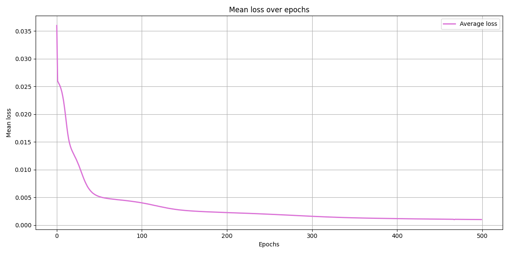
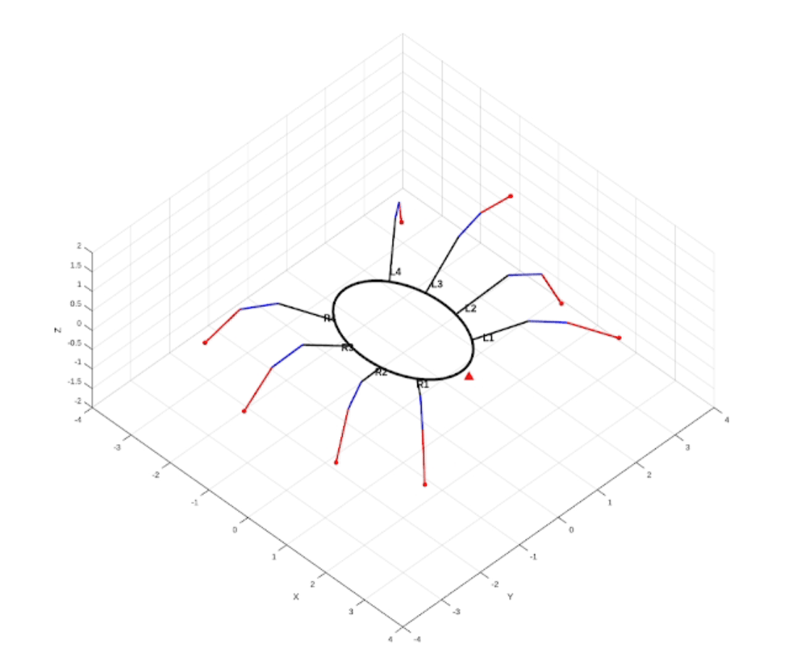
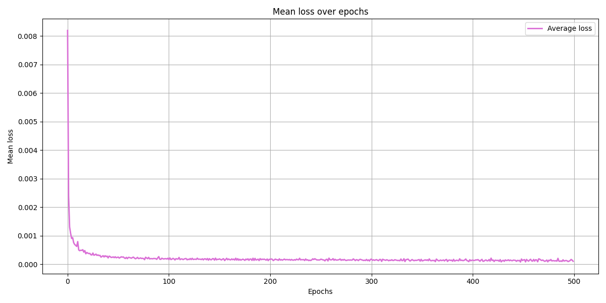
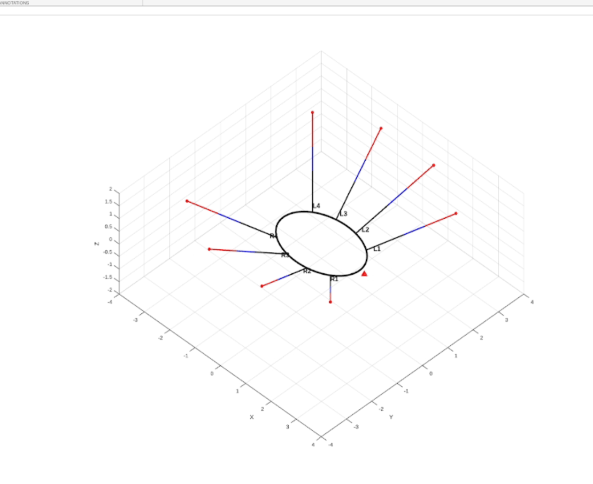
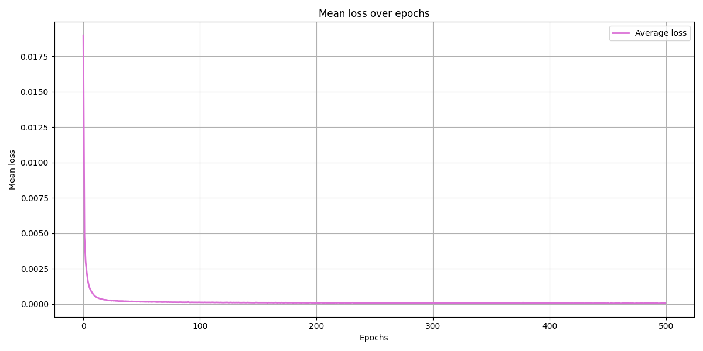
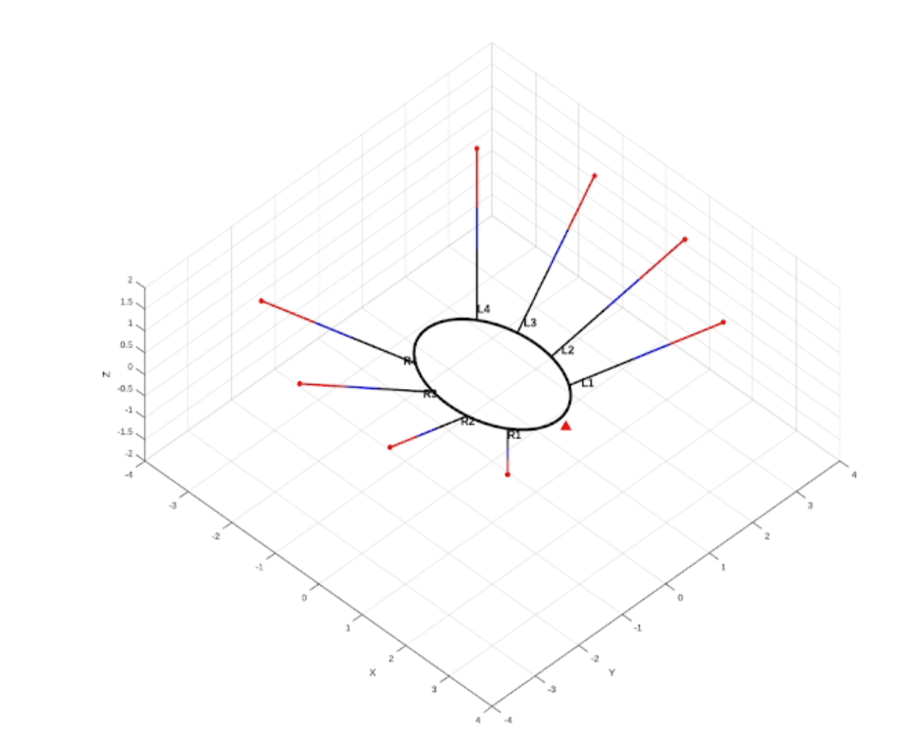
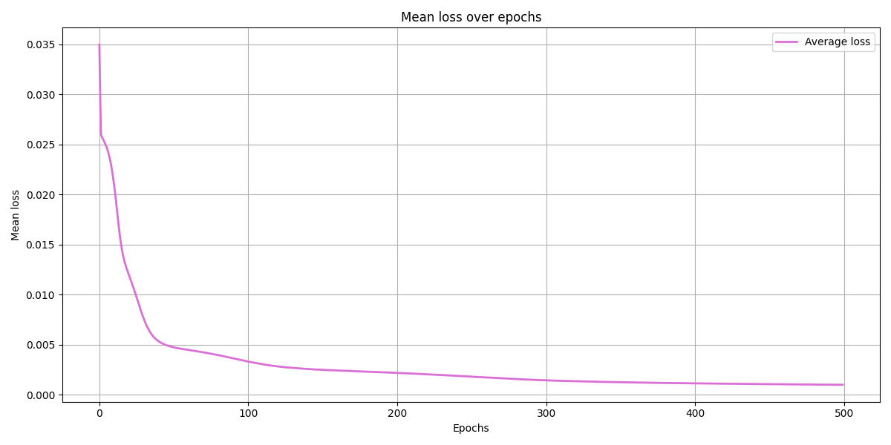
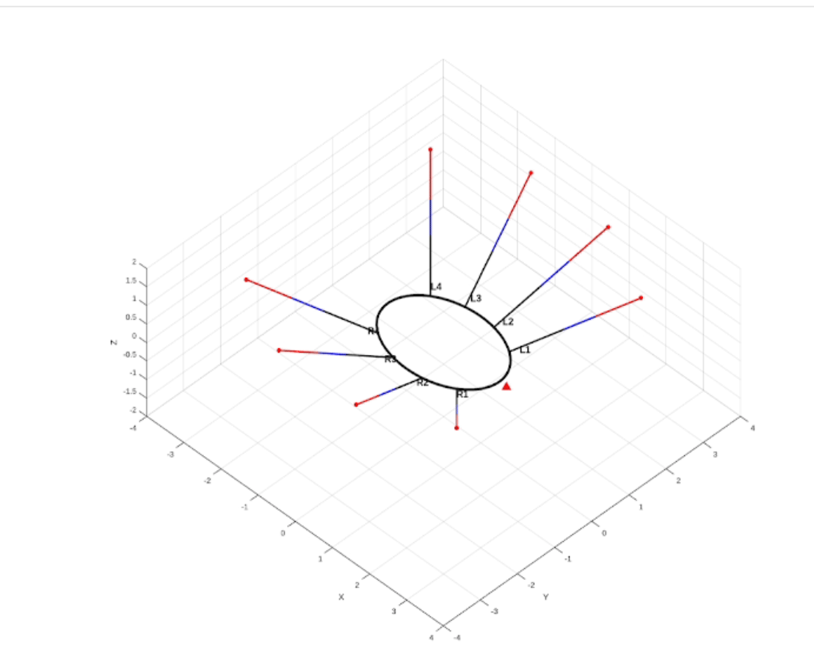
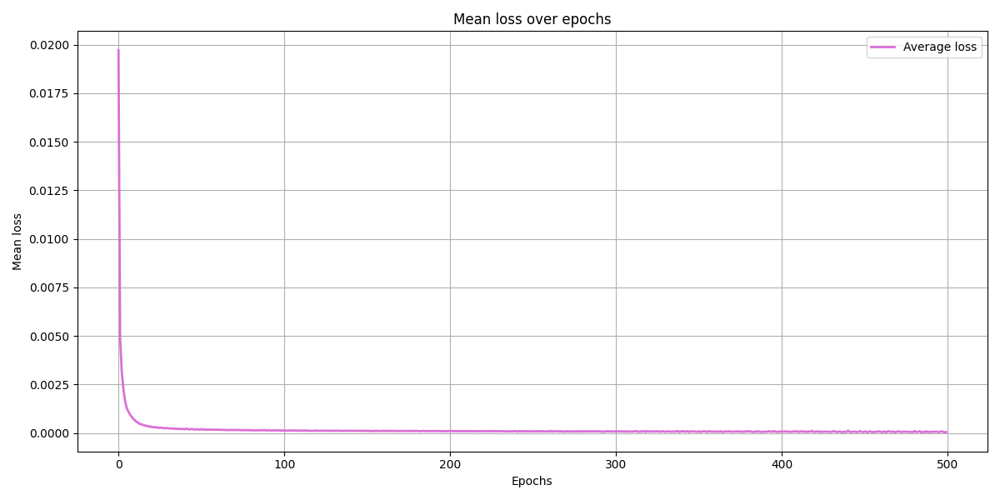
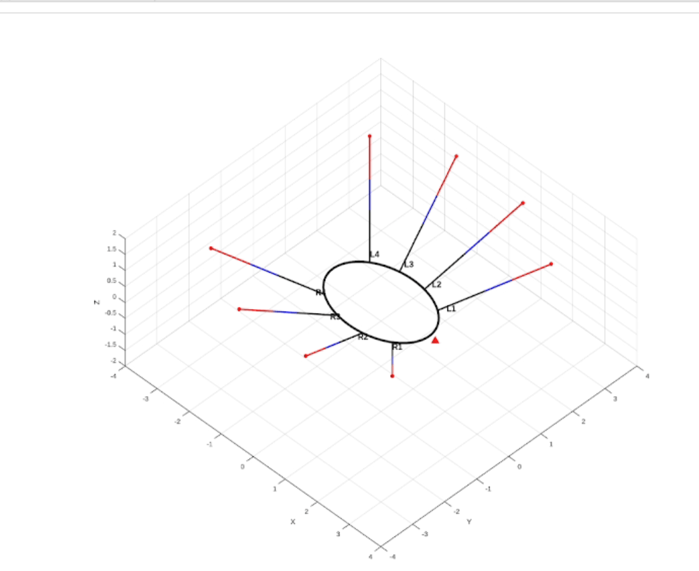

# Neural Network for Spider Gait Prediction

## Table of Contents
1. [Overview](#overview)
2. [Network Architecture](#network-architecture)
   - [Structure](#structure)
   - [Architecture Justification](#architecture-justification)
3. [Activation Functions](#activation-functions)
4. [Loss Function](#loss-function)
5. [Training Method](#training-method)
6. [Backpropagation & Convergence](#backpropagation-and-convergence)
7. [Data Handling & Input/Output Format](#data-handling-and-input-output-format)
8. [MATLAB visualisation](#matlab-visualisation)
9. [Explaination & Justification](#explanation-and-justification)
10. [Conclusion](#conclusion)

---

## Overview

Our neural network predicts the **next frame of a spider's gait** from its current joint configuration. The spider has 8 legs with 3 joints for each (coxa, femur, tibia), resulting in **24 degrees of freedom**. 
**Input/Output**: `[24 joint angles] -> Neural Network -> [24 predicted joint angles]`

### Implementations

We have provided two implementations: **`nn/`** (NumPy from scratch) and **`pytorch_nn/`** (PyTorch framework). The PyTorch version replicates the architecture, training procedure, and hyperparameters of the NumPy implementation for the purpose of direct comparison of the neural networks. However, PyTorch runs significantly slower, with batch size 1, due to framework overhead, PyTorch is optimised for larger batches where GPU acceleration and vectorisation provide substantial speedups, but with single-sample batches, the tensor conversion and computational graph overhead outweighs these benefits compared to our NumPy's direct array operations.

---

## Network Architecture

### Structure

```
Input Layer:     24 neurons (current joint angles)
Hidden Layer 1:  128 neurons + Sigmoid activation
Hidden Layer 2:  64 neurons + Sigmoid activation  
Hidden Layer 3:  32 neurons + Sigmoid activation
Output Layer:    24 neurons + Sigmoid activation (predicted joint angles)
```

**Total Parameters**: ~14,000 trainable weights and biases

### Architecture Justification

| Decision | Rationale |
|----------|-----------|
| **3 Hidden Layers [128, 64, 32]** | Progressive dimensionality reduction for the extraction of hierarchical features. Balances capacity with training efficiency. |
| **Input/Output Shape (24, 24)** | Matches spider's 24 joints. Direct frame-to-frame prediction enables recursive gait generation. |
| **Decreasing Layer Sizes** | Funnels high-dimensional input through compressed representations, learning essential motion patterns. |
| **Fully-Connected (Dense)** | All joints influence each other - legs coordinate during walking. Dense connections capture inter-joint dependencies. |

**Number of layer**
- **Too shallow (1-2 layers)**: Cannot learn complex temporal patterns
- **Too deep (5+ layers)**: Overfits small dataset, slower training, vanishing gradients
- **3 layers**: Optimal for this problem's complexity

---

## Activation Functions

**Choice**: **Sigmoid** activation for all layers

### Justification

| Aspect | Sigmoid Benefits | Why Suitable |
|--------|------------------|--------------|
| **Output Range** | [0, 1] | Matches normalised joint angle range |
| **Non-linearity** | S-curve shape | Captures complex motion patterns |

**Formula**: $\sigma(x) = \frac{1}{1 + e^{-x}}$

**Derivative** (for backpropagation): $\sigma'(x) = \sigma(x)(1 - \sigma(x))$

**Trade-off: In very deep networks, sigmoid may result in vanishing gradients, but it is manageable at three layers. For our normalised data, the bounded output range [0,1] is optimal.

---


## Loss Function

**Choice**: **Mean Squared Error (MSE)**

### Formula

$$\text{MSE} = \frac{1}{n} \sum_{i=1}^{n} (y_i - \hat{y}_i)^2$$

Where:
- $y_i$ = target joint angle (ground truth)
- $\hat{y}_i$ = predicted joint angle  
- $n$ = 24 (number of joints)

### Justification

| Reason | Explanation |
|--------|-------------|
| **Regression Task** | Predicting continuous values (angles), not classification |
| **Penalises Large Errors** | Squared term heavily penalises predictions far from target |
| **Differentiable** | Smooth gradient enables efficient backpropagation |
| **Balanced Across Joints** | Treats all 24 joints equally in error calculation |

**Why Not Other Loss Functions?**
- **MAE (Mean Absolute Error)**: Less sensitive to outliers, but we want to heavily penalise bad predictions

---

## Training Method

All gifs of gait included here are started from the initial position of [0,0,...,0] with 24 0's. The NN then predicts what the next time step should be and this is saved as the next frame. This is repeated 100 times.

### Optimiser Comparison: Gradient Descent vs Adam

Both optimisers were tested with the same sample size which has been shuffled after each epoch to prevent overfitting. The results below show **tested training runs**


#### Default Configuration

| Parameter | Value |
|-----------|-------|
| **Training Data** | 950 samples (1 gait variations × 1000 gait length × 0.95) |
| **Test Data** |  50 samples (5% holdout) |
| **Batch Size** | 1 (SGD - Stochastic Gradient Descent) |
| **Epochs** | 500 |
| **Learning Rate** | 0.001 (both optimisers) |

---

### Stochastic Gradient Descent

**Mathematical Formula**:

$$W_{new} = W_{old} - \eta {\frac{\delta{E}}{\delta{W_{old}}}} $$
where:

- $\eta$ = is learning rate

- $\eta {\frac{\delta{E}}{\delta{W_{old}}}}$= gradient of error with respect to $W_{old}$

**Results with LR = 0.01**:

**Results**:
- **Training Loss**: 0.03598855588900905 -> 0.0010135974419259715 (97.1836% reduction)
- **Test Loss**: 0.001067763894035297
- **Stability**: Good result with very smooth error minimisation curve

**Training Graph Progress**:




**Analysis**:

From the training progress we can see an unusually smooth curve for a model using stochastic gradient descent. Typically we would expect SGD to produce a 'noisy' graph with frequent oscillations. However the smoothness here implies that out learning rate is low enough to keep the descent steady. However, it is also possible that the noise is too small too see, compared to how much the total loss has dropped.

---

### Adam Optimiser

**Mathematical Formula**:

$$m_t = \beta_1 m_{t-1} + (1-\beta_1) \nabla W$$

$$v_t = \beta_2 v_{t-1} + (1-\beta_2) (\nabla W)^2$$

$$\hat{m}_t = \frac{m_t}{1-\beta_1^t}$$

$$\hat{v}_t = \frac{v_t}{1-\beta_2^t}$$

$$W_{new} = W_{old} - \eta \frac{\hat{m}_t}{\sqrt{\hat{v}_t} + \epsilon}$$

where:

- $m_t$ = first moment estimate (momentum) at time step t
- $v_t$ = second moment estimate (adaptive learning rate) at time step t
- $\beta_1$ = exponential decay rate for first moment (default: 0.9)
- $\beta_2$ = exponential decay rate for second moment (default: 0.999)
- $\hat{m}_t$ = bias-corrected first moment estimate
- $\hat{v}_t$ = bias-corrected second moment estimate
- $\eta$ = learning rate (0.001 in our implementation)
- $\nabla W$ = gradient of error with respect to $W_{old}$ (calculated by backpropagation)
- $\epsilon$ = small constant for numerical stability (1e-8)
- $t$ = current time step (iteration number)

**Results with LR = 0.01**:

**Results**:
- **Training Loss**: 0.008190058273522118 -> 0.00010437256305459837 (98.7256% reduction)
- **Test Loss**: 0.00023561222080829665
- **Stability**: Acceptable with consistent minor oscillations.

**Training Progress**:




**Analysis**: 
Over the 500 epochs there are consistent minor oscillations which result in a "noisy" graph.
Reasons for this "noise" because the learning rate was too high for adam, resulting in, overshoot minimisation when combined with the momentum.
Additionally another issue we could be facing is our activation functions becoming saturated, leading to results close to the boundaries (0 and 1).

---

### Adam with Modified Learning Rate

**Mathematical Formula**:

$$m_t = \beta_1 m_{t-1} + (1-\beta_1) \nabla W$$

$$v_t = \beta_2 v_{t-1} + (1-\beta_2) (\nabla W)^2$$

$$\hat{m}_t = \frac{m_t}{1-\beta_1^t}$$

$$\hat{v}_t = \frac{v_t}{1-\beta_2^t}$$

$$W_{new} = W_{old} - \eta \frac{\hat{m}_t}{\sqrt{\hat{v}_t} + \epsilon}$$

where:

- $m_t$ = first moment estimate (momentum) at time step t
- $v_t$ = second moment estimate (adaptive learning rate) at time step t
- $\beta_1$ = exponential decay rate for first moment (default: 0.9)
- $\beta_2$ = exponential decay rate for second moment (default: 0.999)
- $\hat{m}_t$ = bias-corrected first moment estimate
- $\hat{v}_t$ = bias-corrected second moment estimate
- $\eta$ = learning rate (0.001 in our implementation)
- $\nabla W$ = gradient of error with respect to $W_{old}$ (calculated by backpropagation)
- $\epsilon$ = small constant for numerical stability (1e-8)
- $t$ = current time step (iteration number)

**Results with LR = 0.001**:




**Results**:
- **Training Loss**: 0.018982283008555922 -> 5.767988611904117e-05 (99.6961% reduction)
- **Test Loss**: 2.8265682014709896e-05
- **Stability**: Acceptable with consistent tiny oscillations.

**Analysis**:

From this data we can conclude that reducing Adams learning rate to `0.001` improves stability while reducing oscillations, however they are still visible. Despite this adam still offers a significantly lower error compared to gradient descent.

---

### Stochastic Gradient Descent with Modified learning rate

**Mathematical Formula**:

$$W_{new} = W_{old} - \eta {\frac{\delta{E}}{\delta{W_{old}}}} $$

where:

- $\eta$ = is learning rate

- $\eta {\frac{\delta{E}}{\delta{W_{old}}}}$ = gradient of error with respect to $W_{old}$

**Results with LR = 0.001**:

**Results**:
- **Training Loss**: 0.03495881138356216 -> 0.0010041029007837273  (97.1278% reduction)
- **Test Loss**: 0.0008892338786418603
- **Stability**: Extremely stable loss minimisation

**Training Progress**:




**Analysis**:
Extremely stable and smooth decay with a gradual convergence. This is because of the lower learning rate (`0.001`) which produces a stable training curve with zero visible oscillations.

The trade off for the lower learning rate is that, while more stable and conservative, the NN learns significantly slower. We can compare this to the SGD with `0.01` LR and see that they a similar minimum error, however with a higher learning rate it converges on that point much faster (>20 epochs).

### Learning Rate Modification Summary

| Optimiser | LR | Result | Verdict |
|-----------|----|----|---------|
| **Gradient Descent** | 0.01 | Stable with fast convergence | Strong solution |
| **Gradient Descent** | 0.001 | Very stable, slower convergence | Acceptable performance |
| **Adam** | 0.01 | Acceptable stability | Useable however other solutions perform better |
| **Adam** | 0.001 | Stable with good convergence and minimal oscillations | Optimal solution |

Because of these results we decided to use adam with a learning rate of `0.001`, for the following reasons:
- Stable loss minimisation.
- Optimal balance of speed and stability.

---

## Backpropagation and Convergence

### Backpropagation Implementation

**Algorithm**: Chain rule applied layer-by-layer from output to input

Backpropagation calculates how much each weight contributed to the prediction error, so we know how to adjust them during training.

```
1. Calculate initial error (before backpropagation starts):
   error = prediction - target               # How wrong our prediction was
   
2. For each layer (going backward from output to input):
   
   a) Get current layer's activations (stored from forward pass):
      current_outputs = self.outputs[i+1]    # Activations after sigmoid
   
   b) Calculate error signal (δ):
      δ = error × σ'(current_outputs)        # σ' = sigmoid derivative
      
   c) Store error signal for optimizer:
      self.delta[i] = δ                      # Used for bias updates
      
   d) Get previous layer's activations:
      prev_outputs = self.outputs[i]         # Activations from layer before
      
   e) Calculate weight gradient:
      ∇W = prev_outputs^T × δ                # Gradient for weights
      
   f) Pass error to previous layer:
      error = δ × W^T                         # Error for next iteration
```

**Notation Explained**:
- `σ(x)` = sigmoid function = `1 / (1 + e^(-x))`
- `σ'(x)` = sigmoid derivative = `σ(x) × (1 - σ(x))`
- `δ` (delta) = error signal for a layer
- `∇W` (nabla W) = gradient (direction to adjust weights)
- `^T` = transpose (flip rows and columns of matrix)
- `×` = matrix multiplication (using `np.dot()`)

---

## Data Handling and Input Output Format

### Training Data Generation

data is sourced from the genetic algorithm results found at `ga/results/*`

**Data Split**:
- **Training**: 95% (950 samples)
- **Testing**: 5% (50 samples)

### Input/Output Format

**Raw Data**: Joint angles in degrees, range varies by joint type
- Coxa joints: approximately [-23°, 23°]
- Tibia/Femur joints: approximately [-75°, -20°]

**Normalisation**: Map to [0, 1] using expanded bounds

[nn/`input_data.py`](https://github.com/SpindlySpider/UoP-AI-CW/blob/main/nn/input_data.py)

```python
# Used in both input_data.py and load_and_predict.py
normalise = lambda x : (x - minimum_angle) / angle_diff  # (x + 50) / 80
```

**Why [-50°, 30°] bounds (80° range)?**
- Code comment states: "actual range: coxa [-23, 23], tibia-femur approximately [-75, -20]"
- Expanded to [-50°, 30°] to provide safety margin beyond observed extremes
- Ensures no joint angle exceeds [0, 1] bounds after normalisation
- Consistent scaling prevents some joints dominating loss
- Enables stable sigmoid outputs without saturation

### Output Format

**Network Output**: 24 normalised values in [0, 1]

**Denormalisation**: Convert back to degrees

[nn/`load_and_predict.py`](https://github.com/SpindlySpider/UoP-AI-CW/blob/main/nn/load_and_predict.py)

```python
# Used in both training and prediction
denormalise = lambda x : (x * angle_diff) + minimum_angle  # (x * 80) - 50
```

**Usage**: Predicted frame becomes input for next prediction, enabling recursive gait generation

---

## 7. Accuracy of the solution

A series of tests were conducted to evaluate the accuracy of the Non-PyTorch Neural Network compared to the genetic algorithm. One example of the results, based on the dataset in `.\ga\results\ga_results.txt`, is shown below. The following default parameters were used:

```
nn path: nn.pickle
output file name: nn_predict_results.txt
input: [-0.4052899617529597, -50.0, -50.0, -2.147310258776769, -22.831728827184353, -22.801657369204307, -0.4052899617529597, -50.0, -50.0, -2.147310258776769, -22.831728827184353, -22.801657369204307, -0.6523128015771686, -50.0, -50.0, -1.8802243068817395, -23.26931304189508, -23.7150584041192, -0.6523128015771686, -50.0, -50.0, -1.8802243068817395, -23.26931304189508, -23.7150584041192]
gait length: 100
```

Test Input
```
[-0.4052899617529597, -50, -50, -2.147310258776769, -22.831728827184353, -22.801657369204307, -0.4052899617529597, -50, -50, -2.147310258776769, -22.831728827184353, -22.801657369204307, -0.6523128015771686, -50, -50, -1.8802243068817395, -23.26931304189508, -23.7150584041192, -0.6523128015771686, -50, -50, -1.8802243068817395, -23.26931304189508, -23.7150584041192]
```

Target Output (First row)
```
[12.439788201179887, -48.92194320457935, -48.905432874276926, -14.751184012703073, -32.800327022655836, -29.830584653121527, 12.439788201179887, -48.92194320457935, -48.905432874276926, -14.751184012703073, -32.800327022655836, -29.830584653121527, -13.513968820744699, -49.85979841416356, -50, 10.979982043526528, -31.258390668916498, -32.080964488149014, -13.513968820744699, -49.85979841416356, -50, 10.979982043526528, -31.258390668916498, -32.080964488149014]
```

Predicted Output (First row)
```
 [11.376297948557593, -46.71562894276028, -41.82221918132902, -9.83353522466161, -31.26079794443067, -28.263630869785082, 11.328498201973211, -46.57898162273232, -40.65656373012462, -9.775366327932893, -31.9406733541258, -28.62289464625626, -8.303161176048846, -45.67887400725679, -45.28119102228196, 10.331124602147256, -26.38093764361671, -17.24488614257971, -8.137546256755577, -45.62620377495427, -45.284414096813734, 10.814989726578787, -24.492046055135607, -18.044400328376376]
```


Across all 24 joints in this example, the average error difference was **2.8547 degrees**. After testing multiple joints and datasets, it was concluded that the genetic algorithm consistently achieves higher accuracy than the from-scratch neural network.

## MATLAB Visualisation

To visualise the gait in **MATLAB**, use the following script:

```matlab
function plot_spider_pose(angles)
    % plot_spider_pose - Plot a static 3D spider pose based on joint angles
    %
    % Input:
    %   angles: 1x24 vector of joint angles in radians
    %           [theta1_1, theta2_1, theta3_1, ..., theta1_8, theta2_8, theta3_8]
    % Legs are arranged in this configuration: {'L1', 'L2', 'L3', 'L4','R4', 'R3', 'R2', 'R1'}
    
    % Parameters
    n_legs = 8;
    segment_lengths = [1.2, 0.7, 1.0];  % [Coxa, Femur, Tibia]
    a = 1.5; b = 1.0;  % Ellipse axes for body (oval shape)

    % Base angles (L1 front-left to L4 rear-left, R4 rear-right to R1 front-right)
    left_leg_angles = deg2rad([45, 75, 105, 135]);
    right_leg_angles = deg2rad([-135, -105, -75, -45]);
    base_angles = [left_leg_angles, right_leg_angles];

    % Leg labels
    leg_labels = {'L1', 'L2', 'L3', 'L4', 'R4', 'R3', 'R2', 'R1'};

    % Validate input
    if length(angles) ~= n_legs * 3
        error('Input angles must be a 1x24 vector (3 angles per leg for 8 legs).');
    end

    % Setup figure
    figure(1); clf;
    set(gcf, 'Color', '[0,0,0]');
    ax = gca;
    ax.Color = [0.5 0.5 0.5];  
    axis equal;
    grid on;
    hold on;
    xlabel('X'); ylabel('Y'); zlabel('Z');
    %view(45, 45); % window view
    view(90,45);
    xlim([-4 4]); ylim([-4 4]); zlim([-2 2]);

    % Plot body (oval shape)
    t = linspace(0, 2*pi, 100);
    body_x = a * cos(t);
    body_y = b * sin(t);
    plot3(body_x, body_y, zeros(size(t)), 'k-', 'LineWidth', 3);

    % Head marker (front of spider at +X)
    plot3(a + 0.2, 0, 0, 'r^', 'MarkerSize', 10, 'MarkerFaceColor', 'r');

    % Print joint angles for all legs
    fprintf('--- Spider Pose ---\n');
    
    % Loop over legs
    for i = 1:n_legs
        % Indices for this leg's angles
        idx = (i-1)*3 + 1;
        theta1 = angles(idx);
        theta2 = angles(idx+1);
        theta3 = angles(idx+2);

        fprintf('Leg %s: theta1 = %.3f rad, theta2 = %.3f rad, theta3 = %.3f rad\n', ...
            leg_labels{i}, theta1, theta2, theta3);

        % Compute leg base position on body ellipse
        angle = base_angles(i);
        x_base = a * cos(angle);
        y_base = b * sin(angle);
        base_pos = [x_base, y_base, 0];

        % Compute FK for this leg
        [j1, j2, j3, j4] = forward_leg_kinematics2(base_pos, angle, ...
            [theta1, theta2, theta3], segment_lengths);

        % Plot leg segments
        plot3([j1(1), j2(1)], [j1(2), j2(2)], [j1(3), j2(3)], 'k-', 'LineWidth', 2);
        plot3([j2(1), j3(1)], [j2(2), j3(2)], [j2(3), j3(3)], 'b-', 'LineWidth', 2);
        plot3([j3(1), j4(1)], [j3(2), j4(2)], [j3(3), j4(3)], 'r-', 'LineWidth', 2);
        plot3(j4(1), j4(2), j4(3), 'ro', 'MarkerSize', 5, 'MarkerFaceColor', 'r');

        % Label leg
        offset = 0.2;
        label_pos = base_pos + offset * [cos(angle), sin(angle), 0];
        text(label_pos(1), label_pos(2), label_pos(3)+0.05, leg_labels{i}, ...
            'FontSize', 12, 'FontWeight', 'bold');
    end

    hold off;
end

function [j1, j2, j3, j4] = forward_leg_kinematics2(base_pos, base_angle, joint_angles, segment_lengths)
    % base_pos: [x,y,z] position of leg base on body
    % base_angle: angle around body ellipse where leg base is located (radians)
    % joint_angles: [theta1, theta2, theta3] joint angles for the leg in radians
    % segment_lengths: [coxa, femur, tibia] lengths of leg segments
    
    % Unpack joint angles
    theta1 = joint_angles(1); % Coxa yaw (rotation about vertical axis)
    theta2 = joint_angles(2); % Femur pitch
    theta3 = joint_angles(3); % Tibia pitch
    
    % Unpack segment lengths
    L1 = segment_lengths(1);  % Coxa length
    L2 = segment_lengths(2);  % Femur length
    L3 = segment_lengths(3);  % Tibia length
    
    % Joint 1: leg base on body
    j1 = base_pos;  % starting point
    
    % --- Compute Coxa direction with elevation ---
    coxa_elevation = deg2rad(30);  % fixed 30 degree upward pitch for coxa
    
    % Horizontal direction of coxa in XY plane based on base_angle + theta1
    coxa_horiz_dir = [cos(base_angle + theta1), sin(base_angle + theta1), 0];
    
    % Rotation axis for pitch up: perpendicular to coxa horizontal direction in XY plane
    rot_axis = cross(coxa_horiz_dir, [0 0 1]);
    
    % Rotation matrix around rot_axis by coxa_elevation
    R = axis_angle_rotation_matrix(rot_axis, coxa_elevation);
    
    % Rotate horizontal coxa direction upward
    coxa_dir = (R * coxa_horiz_dir')';
    
    % Joint 2 position: end of coxa segment
    j2 = j1 + L1 * coxa_dir;
    
    % --- Femur rotation ---
    % Femur pitch is relative to coxa direction, rotate in plane defined by coxa_dir
    % To simplify, rotate femur around axis perpendicular to coxa_dir and Z
    
    % Define femur rotation axis (perpendicular to coxa_dir and vertical axis)
    femur_rot_axis = cross(coxa_dir, [0 0 1]);
    femur_rot_axis = femur_rot_axis / norm(femur_rot_axis);
    
    % Femur direction vector starts aligned with coxa_dir
    femur_dir = rotate_vector(coxa_dir, femur_rot_axis, theta2);
    
    % Joint 3 position: end of femur segment
    j3 = j2 + L2 * femur_dir;
    
    % --- Tibia rotation ---
    % Tibia pitch is relative to femur direction
    % Rotate tibia around axis perpendicular to femur_dir and vertical axis
    
    tibia_rot_axis = cross(femur_dir, [0 0 1]);
    tibia_rot_axis = tibia_rot_axis / norm(tibia_rot_axis);
    
    % Tibia direction vector
    tibia_dir = rotate_vector(femur_dir, tibia_rot_axis, theta3);
    
    % Joint 4 position: end of tibia segment (foot)
    j4 = j3 + L3 * tibia_dir;
end

% --- Helper function: axis-angle rotation matrix ---
function R = axis_angle_rotation_matrix(axis, angle)
    axis = axis / norm(axis);
    x = axis(1); y = axis(2); z = axis(3);
    c = cos(angle);
    s = sin(angle);
    C = 1 - c;
    R = [ x*x*C + c,   x*y*C - z*s, x*z*C + y*s;
          y*x*C + z*s, y*y*C + c,   y*z*C - x*s;
          z*x*C - y*s, z*y*C + x*s, z*z*C + c ];
end

% --- Helper function: rotate a vector around an axis by an angle ---
function v_rot = rotate_vector(v, axis, angle)
    R = axis_angle_rotation_matrix(axis, angle);
    v_rot = (R * v')';
end


v = readmatrix('nn_predict_results.txt');
A = deg2rad(v);

for idx = 1:size(v,1)
    plot_spider_pose(A(idx,:));
    pause(0.001);
end
```
---

## Explanation and Justification

### Key Design Choices

| Choice | Justification | Trade-offs |
|--------|---------------|------------|
| **Neural Network Architecture** | Simple, proven for regression tasks. Fully-connected layers capture joint interdependencies. | Not optimised for sequential data (RNN would be), but works well for frame-to-frame prediction. |
| **Sigmoid Activation** | Output range [0,1] matches normalised data perfectly. Smooth for continuous motion. | Vanishing gradients in deep networks. Mitigated by keeping network shallow (3 layers). |
| **MSE Loss** | Standard for regression. Penalises large errors heavily, encouraging accurate predictions. | Sensitive to outliers. |
| **Adam Optimizer** | Adaptive learning rates per weight with momentum. Achieves 99.75% loss reduction - significantly better than gradient descent (89%). | More complex with 4 hyperparameters. Requires careful tuning to minimize oscillations. 
| **Learning Rate = 0.001** | Optimal for Adam on this problem - stable convergence with minimal oscillations. Achieves lowest final error. | Lower than typical defaults. Required tuning to find optimal value. |
| **Batch Size = 1** | Updates weights after each individual sample. Simple implementation suitable for small dataset. | Noisier gradients than larger batches, but Adam's momentum helps smooth updates. |
| **95/5 Split** | Large training set maximises learning. 5% test sufficient for validation. | Could use cross-validation for more robust estimates, but single split adequate. |

### Trade-offs

**Depth vs. Complexity**:
- Deeper networks learn more complex patterns but risk overfitting on small datasets
- 3 layers provides sufficient capacity without excessive parameters

**Activation Functions**:
- ReLU would prevent vanishing gradients but unbounded outputs require careful output clipping
- Sigmoid's bounded range is ideal for our normalised data

**Learning Rate**:
- Higher Learning Rate (0.1): Faster convergence but risks divergence
- Lower Learning Rate (0.001): More stable but slower
- **0.001**: Sweet spot for Adam on this problem

---

## 9. Pytorch vs Non Pytorch

### Files Replaced or Removed

The PyTorch implementation consolidates functionality by leveraging PyTorch's built-in modules, eliminating the need for several manual implementations:

| NumPy File | PyTorch Equivalent | Reason |
|------------|-------------------|--------|
| `activation_functions.py` | Built-in `nn.Sigmoid()`, `nn.ReLU()`, etc. | PyTorch provides optimised activation functions |
| `error_funcs.py` | Built-in `nn.MSELoss()` | PyTorch's loss functions integrate with autograd |
| `neural_network.py` | **`torch_model.py`** | Replaced with `nn.Module` class structure |
| `optimiser.py` | Built-in `torch.optim.Adam()` | PyTorch optimisers handle weight updates automatically |
| `training.py` | **`torch_training.py`** | Adapted for PyTorch's `loss.backward()` and `optimiser.step()` |
| `load_and_predict.py` | **`load_and_predict.py`** | Adapted for PyTorch model loading and inference |
| `input_data.py` | **Shared** from `nn/` | Data generation remains framework-agnostic |
| `serialise.py` | **`serialise.py`** (rewritten) | Uses `torch.save()` / `torch.load()` instead of pickle |
| `graph_results.py` | **`graph_results.py`** (adapted) | Modified for PyTorch training output format |

PyTorch eliminates ~50 lines of core backpropagation code (gradient calculations in `back_propagation()`, weight updates in `adam()`, and activation derivatives) by using built-in modules, demonstrating the framework's abstraction benefits. Overall, ~355 lines across all eliminated files are replaced by PyTorch's built-in functionality.

### Output comparisons between Pytorch and Non Pytorch implementation

Multiple test have been done to test whether the solution of these would be the same 

#### Training Loss Curves

Non Pytorch


Pytorch



Adam optimisation with a learning rate of 0.001 was used for this comparison, consistent with the implementation of the non-PyTorch network and the findings discussed above. As shown in the graph, the results are virtually identical; this is expected, as both models use the same architecture and the same dataset.

#### Prediction Output Comparison

One example of the results, based on the dataset in `.\ga\results\ga_results.txt`, is shown below. The following default parameters were used:

```
nn path: nn.pickle
output file name: nn_predict_results.txt
input: [-0.4052899617529597, -50.0, -50.0, -2.147310258776769, -22.831728827184353, -22.801657369204307, -0.4052899617529597, -50.0, -50.0, -2.147310258776769, -22.831728827184353, -22.801657369204307, -0.6523128015771686, -50.0, -50.0, -1.8802243068817395, -23.26931304189508, -23.7150584041192, -0.6523128015771686, -50.0, -50.0, -1.8802243068817395, -23.26931304189508, -23.7150584041192]
gait length: 100
```

Test Input
```
[-0.4052899617529597, -50, -50, -2.147310258776769, -22.831728827184353, -22.801657369204307, -0.4052899617529597, -50, -50, -2.147310258776769, -22.831728827184353, -22.801657369204307, -0.6523128015771686, -50, -50, -1.8802243068817395, -23.26931304189508, -23.7150584041192, -0.6523128015771686, -50, -50, -1.8802243068817395, -23.26931304189508, -23.7150584041192]
```

Target (First row)
```
[12.439788201179887, -48.92194320457935, -48.905432874276926, -14.751184012703073, -32.800327022655836, -29.830584653121527, 12.439788201179887, -48.92194320457935, -48.905432874276926, -14.751184012703073, -32.800327022655836, -29.830584653121527, -13.513968820744699, -49.85979841416356, -50, 10.979982043526528, -31.258390668916498, -32.080964488149014, -13.513968820744699, -49.85979841416356, -50, 10.979982043526528, -31.258390668916498, -32.080964488149014]
```

Non Pytorch Predicted Ouput (First row)
```
 [11.376297948557593, -46.71562894276028, -41.82221918132902, -9.83353522466161, -31.26079794443067, -28.263630869785082, 11.328498201973211, -46.57898162273232, -40.65656373012462, -9.775366327932893, -31.9406733541258, -28.62289464625626, -8.303161176048846, -45.67887400725679, -45.28119102228196, 10.331124602147256, -26.38093764361671, -17.24488614257971, -8.137546256755577, -45.62620377495427, -45.284414096813734, 10.814989726578787, -24.492046055135607, -18.044400328376376]
```

Pytorch Predicted Output (First row)
```
[12.422871, -48.913944, -47.124588, -14.648678, -32.278236, -29.423143, 12.437759, -48.91127, -47.119846, -14.653755, -32.298367, -29.432486, -13.755196, -49.016434, -49.924458, 10.81287, -30.454441, -30.841265, -13.7559395, -49.017014, -49.923866, 10.808197, -30.481699, -30.875584]
```

Across multiple tests, the PyTorch implementation consistently matches the performance of the manually implemented network and, in many cases, surpasses it in accuracy, demonstrating greater reliability and more precise convergence overall.

For this example, the average prediction error between the PyTorch and Non-PyTorch outputs is **3.955931°**, while the error between the PyTorch predictions and the target values is only **0.455986°**, compared to **2.8547°** for the Non-PyTorch network. Across multiple tests, this trend does not remains consistent.


## Conclusion

This neural network successfully learns to predict successive joint configuration using our well designed architecture which uses a 3 hidden layer neural network with 128->64->32 neurons, allowing non-linear relationships to be learnt. We used a sigmoid activation for outputs between 0 and 1, and apply MSE as the loss function for regression. A stable training process was achieved using gradient descent with a learning rate of 0.01, where backpropagation led to an 89% loss reduction and smooth convergence. Input data was normalised, and additional synthetic samples were generated using multiple target solutions to enhance training performance.

Both **Non PyTorch** and **PyTorch** implementations achieve very similar results, giving more validity to out neural network created from scratch, while demonstrating modern framework integration.

