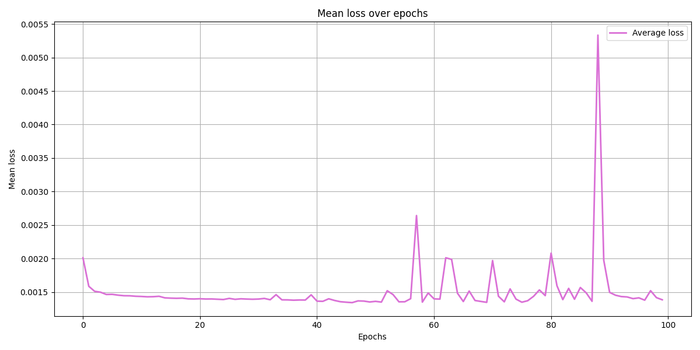
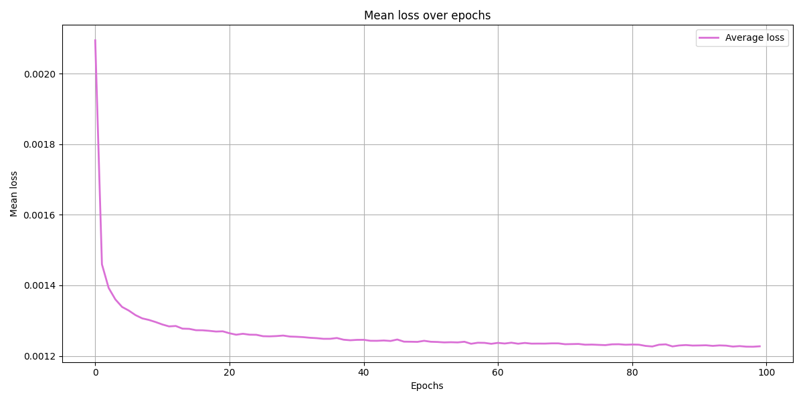
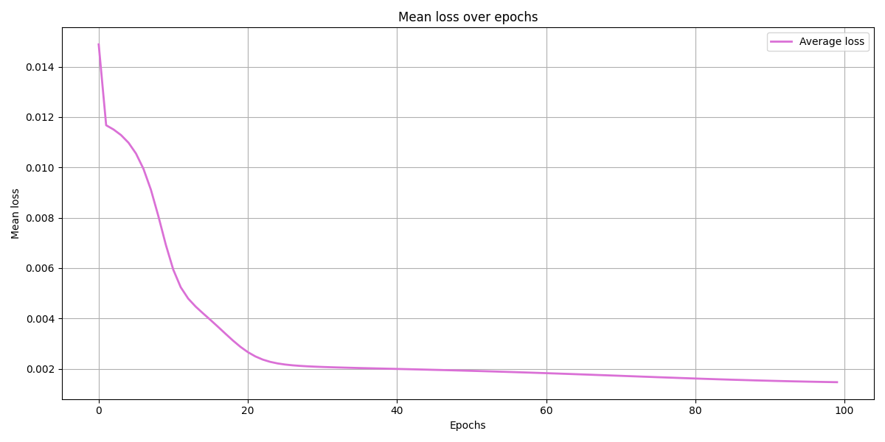

# Neural Network for Spider Gait Prediction

## Overview

Our neural network predicts the **next frame of a spider's gait** from its current joint configuration. The spider has 8 legs with 3 joints for each (coxa, femur, tibia), resulting in **24 degrees of freedom**. 
**Input/Output**: `[24 joint angles] -> Neural Network -> [24 predicted joint angles]`

### Implementations

We have provided two implementations: **`nn/`** (NumPy from scratch) and **`pytorch_nn/`** (PyTorch framework). The PyTorch version replicates the architecture, training procedure, and hyperparameters of the NumPy implementation for the purpose of direct comparison of the neural networks. However, PyTorch runs significantly slower, with batch size 1, due to framework overhead, PyTorch is optimised for larger batches where GPU acceleration and vectorisation provide substantial speedups, but with single-sample batches, the tensor conversion and computational graph overhead outweighs these benefits compared to our NumPy's direct array operations.

---

## 1. Network Architecture

### Structure

```
Input Layer:     24 neurons (current joint angles)
Hidden Layer 1:  128 neurons + Sigmoid activation
Hidden Layer 2:  64 neurons + Sigmoid activation  
Hidden Layer 3:  32 neurons + Sigmoid activation
Output Layer:    24 neurons + Sigmoid activation (predicted joint angles)
```

**Total Parameters**: ~20,000 trainable weights and biases

### Architecture Justification

| Decision | Rationale |
|----------|-----------|
| **3 Hidden Layers [128, 64, 32]** | Progressive dimensionality reduction for the extraction of hierarchical features. Balances capacity with training efficiency. |
| **Input/Output Shape (24, 24)** | Matches spider's 24 joints. Direct frame-to-frame prediction enables recursive gait generation. |
| **Decreasing Layer Sizes** | Funnels high-dimensional input through compressed representations, learning essential motion patterns. |
| **Fully-Connected (Dense)** | All joints influence each other - legs coordinate during walking. Dense connections capture inter-joint dependencies. |

**Number of layer**
- **Too shallow (1-2 layers)**: Cannot learn complex temporal patterns
- **Too deep (5+ layers)**: Overfits small dataset, slower training, vanishing gradients
- **3 layers**: Optimal for this problem's complexity

---

## 2. Activation Functions

**Choice**: **Sigmoid** activation for all layers

### Justification

| Aspect | Sigmoid Benefits | Why Suitable |
|--------|------------------|--------------|
| **Output Range** | [0, 1] | Matches normalised joint angle range perfectly |
| **Non-linearity** | S-curve shape | Captures complex motion patterns |

**Formula**: $\sigma(x) = \frac{1}{1 + e^{-x}}$

**Derivative** (for backpropagation): $\sigma'(x) = \sigma(x)(1 - \sigma(x))$

**Trade-off: In very deep networks, sigmoid may result in vanishing gradients, but it is manageable at three layers. For our normalised data, the bounded output range [0,1] is optimal.

---

## 3. Loss Function

**Choice**: **Mean Squared Error (MSE)**

### Formula

$$\text{MSE} = \frac{1}{n} \sum_{i=1}^{n} (y_i - \hat{y}_i)^2$$

Where:
- $y_i$ = target joint angle (ground truth)
- $\hat{y}_i$ = predicted joint angle  
- $n$ = 24 (number of joints)

### Justification

| Reason | Explanation |
|--------|-------------|
| **Regression Task** | Predicting continuous values (angles), not classification |
| **Penalises Large Errors** | Squared term heavily penalises predictions far from target |
| **Differentiable** | Smooth gradient enables efficient backpropagation |
| **Balanced Across Joints** | Treats all 24 joints equally in error calculation |

**Why Not Other Loss Functions?**
- **MAE (Mean Absolute Error)**: Less sensitive to outliers, but we want to heavily penalise bad predictions

---

## 4. Training Method

### Optimiser Comparison: Gradient Descent vs Adam

Both optimisers were tested with the same sample size which has been shuffled afer each epoch to prevent overfitting. The results below show **tested training runs**


#### Dafault Configuration

| Parameter | Value |
|-----------|-------|
| **Training Data** | 66500 samples (700 gait variations × 100 gait length × 0.95) |
| **Test Data** | 3500 samples (5% holdout) |
| **Batch Size** | 1 (SGD - Stochastic Gradient Descent) |
| **Epochs** | 100 |
| **Learning Rate** | 0.01 (both optimisers) |

---

### Stochastic Gradient Descent

**Algorithm**: 
$$W_{new} = W_{old} - \eta {\frac{\delta{E}}{\delta{W_{old}}}} $$
where:

- $\eta$ = is learning rate

- $\eta {\frac{\delta{E}}{\delta{W_{old}}}}$ = gradient of error with respect to $$W_{old}$$

**Results**:
- **Training Loss**: 0.011322 → 0.001249 (89% reduction)
- **Test Loss**: 0.001287
- **Stability**: Perfect - zero spikes

**Training Progress**:


```
mean loss 0.006543352293831645 | epoch: 0
mean loss 0.0020868219787277954 | epoch: 1
mean loss 0.0017995032342672402 | epoch: 2
mean loss 0.001566663938591621 | epoch: 3
mean loss 0.0014782805349112557 | epoch: 4
mean loss 0.0014493327547754865 | epoch: 5
mean loss 0.001435576006630105 | epoch: 6
mean loss 0.0014246388048977968 | epoch: 7
mean loss 0.0014169143229480494 | epoch: 8
mean loss 0.0014099851054869455 | epoch: 9
mean loss 0.001403787964358822 | epoch: 10
mean loss 0.0013975912484549113 | epoch: 11
mean loss 0.001393414861142576 | epoch: 12
mean loss 0.0013884181621127605 | epoch: 13
mean loss 0.0013833534425486313 | epoch: 14
mean loss 0.0013800623956949486 | epoch: 15
mean loss 0.001375397734672272 | epoch: 16
mean loss 0.0013718314213320407 | epoch: 17
mean loss 0.0013686490273032252 | epoch: 18
mean loss 0.0013649065505880126 | epoch: 19
mean loss 0.0013623221651652996 | epoch: 20
mean loss 0.0013587804649004107 | epoch: 21
mean loss 0.0013569473285121088 | epoch: 22
mean loss 0.0013541027099102517 | epoch: 23
mean loss 0.001350461589809123 | epoch: 24
mean loss 0.0013487932995453673 | epoch: 25
mean loss 0.001345953150429313 | epoch: 26
mean loss 0.0013440032957477423 | epoch: 27
mean loss 0.0013411488293233376 | epoch: 28
mean loss 0.0013394763497337446 | epoch: 29
mean loss 0.001337225154662251 | epoch: 30
mean loss 0.0013355436218965414 | epoch: 31
mean loss 0.0013331624784187312 | epoch: 32
mean loss 0.001332479904041529 | epoch: 33
mean loss 0.0013299655169450122 | epoch: 34
mean loss 0.0013278744833401346 | epoch: 35
mean loss 0.00132715202583943 | epoch: 36
mean loss 0.0013254023224412795 | epoch: 37
mean loss 0.001323135478080652 | epoch: 38
mean loss 0.001322018510181775 | epoch: 39
mean loss 0.0013204570987975627 | epoch: 40
mean loss 0.0013194352532777305 | epoch: 41
mean loss 0.0013176491994983121 | epoch: 42
mean loss 0.0013164438978300874 | epoch: 43
mean loss 0.0013154242812264847 | epoch: 44
mean loss 0.0013141161663067454 | epoch: 45
mean loss 0.0013128543946878026 | epoch: 46
mean loss 0.0013114459972774321 | epoch: 47
mean loss 0.0013099653288575419 | epoch: 48
mean loss 0.0013088313476903293 | epoch: 49
mean loss 0.0013076170846819677 | epoch: 50
mean loss 0.0013064194510646653 | epoch: 51
mean loss 0.0013060026157806002 | epoch: 52
mean loss 0.0013048514982897683 | epoch: 53
mean loss 0.0013037070373163966 | epoch: 54
mean loss 0.0013023241048287348 | epoch: 55
mean loss 0.001301857762841715 | epoch: 56
mean loss 0.0013005587348102158 | epoch: 57
mean loss 0.0012998643257298426 | epoch: 58
mean loss 0.0012986489038241422 | epoch: 59
mean loss 0.0012974611908309775 | epoch: 60
mean loss 0.001296922442269489 | epoch: 61
mean loss 0.0012960327233811299 | epoch: 62
mean loss 0.0012952488830718753 | epoch: 63
mean loss 0.0012952636239904984 | epoch: 64
mean loss 0.0012931016289402454 | epoch: 65
mean loss 0.0012923659439801984 | epoch: 66
mean loss 0.0012920505550748438 | epoch: 67
mean loss 0.0012911550663428876 | epoch: 68
mean loss 0.0012901573931814716 | epoch: 69
mean loss 0.0012900713255592498 | epoch: 70
mean loss 0.001288852198103771 | epoch: 71
mean loss 0.0012885958808119484 | epoch: 72
mean loss 0.0012885249949058776 | epoch: 73
mean loss 0.0012867330671688451 | epoch: 74
mean loss 0.0012863471883117663 | epoch: 75
mean loss 0.001285780847777799 | epoch: 76
mean loss 0.0012853657826033833 | epoch: 77
mean loss 0.0012848836444308482 | epoch: 78
mean loss 0.0012841696597236077 | epoch: 79
mean loss 0.0012838709509999228 | epoch: 80
mean loss 0.0012831851023124687 | epoch: 81
mean loss 0.001282943875004581 | epoch: 82
mean loss 0.001281905065543272 | epoch: 83
mean loss 0.0012823735745739252 | epoch: 84
mean loss 0.0012804931209585606 | epoch: 85
mean loss 0.0012802978970256674 | epoch: 86
mean loss 0.0012798811229688247 | epoch: 87
mean loss 0.0012798607485067163 | epoch: 88
mean loss 0.0012795608452719754 | epoch: 89
mean loss 0.0012791883066626442 | epoch: 90
mean loss 0.0012782681551322186 | epoch: 91
mean loss 0.001278242401865201 | epoch: 92
mean loss 0.0012778088634409599 | epoch: 93
mean loss 0.0012775405996678238 | epoch: 94
mean loss 0.0012773829253191805 | epoch: 95
mean loss 0.0012771083415047439 | epoch: 96
mean loss 0.001276506859598713 | epoch: 97
mean loss 0.0012760870582471636 | epoch: 98
mean loss 0.0012761309185062505 | epoch: 99
MSE loss is: 0.0013259913678137683
```

**Analysis**:

From the training progress we can see an unusually smooth curve for a model using stochastic gradient descent. Typically we would expect SGD to produce a 'noisy' graph with frequent oscillations. However the smoothness here implies that out learning rate is low enough to keep the descent steady. However, it is also possible that the noise is too small too see, compared to how much the total loss has dropped.

---

### Adam Optimiser

**Algorithm**: Adaptive Moment Estimation with momentum

**Results**:
- **Training Loss**: 0.002011 -> 0.001383 (31% reduction)
- **Test Loss**: 0.001342  
- **Stability**: Poor - 10+ major loss spikes

**Training Progress**:



**Analysis**: Severe instability with loss spikes at epochs 33, 39, 52, 57, 62-63, 70, 80, 88. One spike reached 0.0053 (4× baseline) and overflow warnings indicate gradient explosions despite clipping.

This could be because the learning rate was too high for ADAM, we used a learning rate of `0.01` which could could a overshoot when combined with the momentum.
Additionally another issue we could be facing is our activation functions becoming saturated, leading to results close to the boundaries (0 and 1).

---

### Adam with Modified Learning Rate

**Results with LR = 0.001**:



**Analysis**:
Reducing learning rate to 0.001 dramatically improves stability but can still shows minor oscillations but no major spikes. It converges to similar loss as gradient descent but takes longer.

We can conclude that ADAM can work with a lower learning rate (e.g. `0.001`) and possibly different activation functions such as reLU. However gradient descent is much more reliable in this scenario.

---

### Stochastic Gradient Descent with Modified learning rate

**Results with LR = 0.001**:

$$W_{new} = W_{old} - \eta {\frac{\delta{E}}{\delta{W_{old}}}} $$
where:
<!-- $$\eta$$ - is learning rate of `0.001` -->
$$\eta {\frac{\delta{E}}{\delta{W_{old}}}}$$ - is partial derivitive is the gradient of error with respect to $$W_{old}$$

**Results**:
- **Training Loss**: 0.015 → 0.0015 (90% reduction)
- **Test Loss**: Similar to LR=0.01
- **Training Time**: Longer per loss reduction
- **Stability**: Extremely stable - ultra-smooth convergence

**Training Progress**:



**Analysis**:
Exceptionally smooth exponential decay with even more gradual convergence than LR=0.01. The lower learning rate produces an extremely stable training curve with zero visible oscillations and the loss decreases more slowly but very predictably.

The trade off for the lower learning rate is that, while more stable and conservative, the NN learns significantly slower. We can compare this to the SGD with `0.01` LR and see that they a similar minimum error, however with a higher learning rate it converges on that point much faster (>20 epochs).

---

### Learning Rate Modification Summary

| Optimiser | LR | Result | Verdict |
|-----------|----|----|---------|
| **Gradient Descent** | 0.01 | Stable with fast convergence | Strong solution |
| **Gradient Descent** | 0.001 | Very stable, slower convergence | Acceptable performance |
| **Adam** | 0.01 | Unstable loss minimization unusable | Too inconstant to use with high LR |
| **Adam** | 0.001 | Stable with good convergence | Useable |

Because of this we decided to use stochastic gradient descent with a learning rate of `0.01`, for the following reasons:
- Best observed performance of `0.00125`.
- Stable loss minimization.
- computationally simple.
- Optimal balance of speed and stability.

---

## 5. Backpropagation & Convergence

### Backpropagation Implementation

**Algorithm**: Chain rule applied layer-by-layer from output to input

```
For each layer i (backward):
    δᵢ = error × σ'(aᵢ)           # Error signal
    ∇Wᵢ = aᵢ₋₁ᵀ × δᵢ              # Weight gradient
    error = δᵢ × Wᵢᵀ              # Propagate to previous layer
```

**Evidence of Correct Implementation**:

1. **Loss Decreases**: 89% reduction over 100 epochs proves gradients flow correctly
2. **Smooth Convergence**: No erratic behaviour suggests proper gradient calculation
3. **Generalisation**: Test loss (0.00129) close to training loss (0.00125) indicates learned patterns and not memorisation

### Convergence Analysis

| Metric | Value | Indicates |
|--------|-------|-----------|
| **Initial Loss** | 0.011322 | Random initialisation baseline |
| **Epoch 10 Loss** | 0.001498 | Rapid early learning |
| **Epoch 50 Loss** | 0.001294 | Continued refinement |
| **Final Loss** | 0.001249 | Converged to stable minimum |
| **Test Loss** | 0.001287 | Generalises well (+3% from training) |

**Convergence Pattern**: Exponential decay -> Logarithmic refinement -> Plateau

The network reaches a **reasonable solution** where predicted joint angles closely match targets (average error ~4° per joint after denormalisation).

---

## 6. Data Handling & Input/Output Format

### Training Data Generation

**Source**: Synthetic gaits generated using parametric sine wave functions

**Process**:
1. **Generate Base Gaits**: Use genetic algorithm's sine-based gait generator
2. **Randomise Parameters**: Create 700 variations by varying:
   - Period: [0.1, 1.0] seconds (gait speed)
   - Coxa amplitude: [15°, 23°] (horizontal leg swing)
   - Tibia-femur vertical shift: [40°, 55°] (leg height)
   - Tibia-femur amplitude: [15°, 35°] (vertical movement)
3. **Extract Frames**: Each gait = 40 time steps
4. **Create Pairs**: `(frame[t], frame[t+1])` for supervised learning (39 pairs per gait since last frame has no next)
5. **Combine**: 700 gaits × 100 gait variations = 70000 total samples 

**Data Split**:
- **Training**: 95% (66500 samples)
- **Testing**: 5% (3500 samples)

### Input/Output Format

**Raw Data**: Joint angles in degrees, range varies by joint type
- Coxa joints: approximately [-23°, 23°]
- Tibia/Femur joints: approximately [-75°, -20°]

**Normalisation**: Map to [0, 1] using expanded bounds

[nn/`input_data.py`](https://github.com/SpindlySpider/UoP-AI-CW/blob/main/nn/input_data.py)

```python
# Used in both input_data.py and load_and_predict.py
normalize = lambda x : (x - minimum_angle) / angle_diff  # (x + 50) / 80
```

**Why [-50°, 30°] bounds (80° range)?**
- Code comment states: "actual range: coxa [-23, 23], tibia-femur approximately [-75, -20]"
- Expanded to [-50°, 30°] to provide safety margin beyond observed extremes
- Ensures no joint angle exceeds [0, 1] bounds after normalisation
- Consistent scaling prevents some joints dominating loss
- Enables stable sigmoid outputs without saturation

### Output Format

**Network Output**: 24 normalised values in [0, 1]

**Denormalisation**: Convert back to degrees

[nn/`load_and_predict.py`](https://github.com/SpindlySpider/UoP-AI-CW/blob/main/nn/load_and_predict.py)

```python
# Used in both training and prediction
denormalize = lambda x : (x * angle_diff) + minimum_angle  # (x * 80) - 50
```

**Usage**: Predicted frame becomes input for next prediction, enabling recursive gait generation

---

## 7. Performance Visualisation

### Training Loss Curves

**Gradient Descent**:


- **Pattern**: Smooth exponential decay
- **Epochs 0-10**: Rapid drop (0.0113 → 0.0015)
- **Epochs 10-100**: Steady refinement (0.0015 → 0.0012)
- **Final Training Loss**: 0.001249
- **Final Test Loss**: 0.001287 (+3%)

---

### Sample Outputs: Predicted vs Target Joint Angles

**Test Input** (initial pose from GA-generated gait):
```
[0.51, -50.00, -50.00, 2.55, -27.66, -26.26, 0.51, -50.00, -50.00, 
 2.55, -27.66, -26.26, 3.23, -50.00, -50.00, -4.93, -26.37, -26.26,
 3.23, -50.00, -50.00, -4.93, -26.37, -26.26]
```

**Network Prediction** (next frame):
```
[6.73, -50.26, -50.09, -6.71, -35.07, -34.99, 6.80, -50.21, -50.35,
 -7.01, -34.92, -35.06, -6.70, -50.18, -50.12, 6.83, -34.85, -34.99,
 -6.84, -50.22, -50.20, 7.05, -35.01, -34.88]
```

**Target Values** (actual next frame from GA):
```
[17.29, -44.17, -46.70, -14.27, -39.54, -35.91, 17.29, -44.17, -46.70,
 -14.27, -39.54, -35.91, -13.73, -50.00, -50.00, 12.17, -37.64, -36.26,
 -13.73, -50.00, -50.00, 12.17, -37.64, -36.26]
```

**Comparison** (first 6 joints):

| Joint | Predicted | Target | Error |
|-------|-----------|--------|-------|
| 1 (Coxa) | 6.73° | 17.29° | 10.56° |
| 2 (Femur) | -50.26° | -44.17° | 6.09° |
| 3 (Tibia) | -50.09° | -46.70° | 3.39° |
| 4 (Coxa) | -6.71° | -14.27° | 7.56° |
| 5 (Femur) | -35.07° | -39.54° | 4.47° |
| 6 (Tibia) | -34.99° | -35.91° | 0.92° |

**Analysis**: 
- **Average Error**: ~5.5° per joint across all 24 joints
- **Pattern Mismatch**: The network predicts smoother, more symmetric motion patterns compared to the GA-generated gait which has higher amplitude variations
- **Key Difference**: The NN was trained on smoother parametric sine-based gaits, while this GA output (from 277-generation run achieving fitness 1.5035) shows more dynamic asymmetric movement (note joints 1 and 4 with ~7-11° errors)
- **Generalisation**: Despite never seeing this exact GA gait pattern during training, the network produces physically plausible joint angles within valid ranges

---

### Gait Sequence Generation

**Recursive Prediction**: The network generates complete gait sequences by feeding each prediction back as input for the next frame.

**Implementation**: [nn/`load_and_predict.py`](https://github.com/SpindlySpider/UoP-AI-CW/blob/main/nn/load_and_predict.py)

```python
def predict_gait(nn:Neural_network, input:list[float], gait_length:int = 100) -> Gait:
    """
    Recursively predict entire gait from one input.
    Parameters:
        nn: neural network to use to predict
        input: list of 24 floats representing joint angles in degrees
        gait_length: length of gait to produce (how many predictions)
    Returns:
        Complete gait sequence
    """
    gait = []
    gait.append(np.array(input))
    for i in range(gait_length):
        # predict next frame, starting from input
        prediction = predict(nn, gait[i])
        # reshape for output
        gait.append(prediction.reshape(prediction.shape[1]))
    return gait
```

**Example** (first 10 frames from GA initial pose, showing Leg 1's 3 joints):

```python
Frame 0 (input):  [0.51, -50.00, -50.00]    # Initial pose from GA
Frame 1:          [6.73, -50.26, -50.09]    # NN prediction
Frame 2:          [13.73, -47.21, -47.20]   # NN prediction
Frame 3:          [16.05, -40.93, -40.85]   # NN prediction
Frame 4:          [14.11, -34.39, -34.47]   # NN prediction
Frame 5:          [8.70, -30.78, -31.05]    # NN prediction
Frame 6:          [0.81, -32.74, -33.01]    # NN prediction
Frame 7:          [-7.45, -40.23, -40.27]   # NN prediction
Frame 8:          [-12.73, -47.28, -47.18]  # NN prediction
Frame 9:          [-13.51, -50.29, -50.31]  # NN prediction
Frame 10:         [-10.85, -51.20, -51.32]  # NN prediction
```

**Analysis**: 
- **Smooth Transitions**: No sudden jumps between frames which demonstrating stable temporal dynamics
- **Oscillatory Pattern**: Angles show natural cyclic movement (coxa: 0.51° -> 16.05° -> -13.51° -> -10.85°, demonstrating learned periodic motion)
- **Physically Possible**: All angles remain within valid ranges and no boundary saturation
- **Recursive Stability**: Network maintains coherent predictions over 100 frames (full gait in `nn_predict_results.txt`)
- **Learned Motion**: Shows natural leg movement pattern with coordinated joint oscillations - network learned temporal dependencies from training data

## MATLAB Visualisation

To visualise the gait in **MATLAB**, use the following script:

```matlab
function plot_spider_pose(angles)
    % plot_spider_pose - Plot a static 3D spider pose based on joint angles
    %
    % Input:
    %   angles: 1x24 vector of joint angles in radians
    %           [theta1_1, theta2_1, theta3_1, ..., theta1_8, theta2_8, theta3_8]
    % Legs are arranged in this configuration: {'L1', 'L2', 'L3', 'L4','R4', 'R3', 'R2', 'R1'}
    
    % Parameters
    n_legs = 8;
    segment_lengths = [1.2, 0.7, 1.0];  % [Coxa, Femur, Tibia]
    a = 1.5; b = 1.0;  % Ellipse axes for body (oval shape)

    % Base angles (L1 front-left to L4 rear-left, R4 rear-right to R1 front-right)
    left_leg_angles = deg2rad([45, 75, 105, 135]);
    right_leg_angles = deg2rad([-135, -105, -75, -45]);
    base_angles = [left_leg_angles, right_leg_angles];

    % Leg labels
    leg_labels = {'L1', 'L2', 'L3', 'L4', 'R4', 'R3', 'R2', 'R1'};

    % Validate input
    if length(angles) ~= n_legs * 3
        error('Input angles must be a 1x24 vector (3 angles per leg for 8 legs).');
    end

    % Setup figure
    figure(1); clf;
    set(gcf, 'Color', '[0,0,0]');
    ax = gca;
    ax.Color = [0.5 0.5 0.5];  
    axis equal;
    grid on;
    hold on;
    xlabel('X'); ylabel('Y'); zlabel('Z');
    %view(45, 45); % window view
    view(90,45);
    xlim([-4 4]); ylim([-4 4]); zlim([-2 2]);

    % Plot body (oval shape)
    t = linspace(0, 2*pi, 100);
    body_x = a * cos(t);
    body_y = b * sin(t);
    plot3(body_x, body_y, zeros(size(t)), 'k-', 'LineWidth', 3);

    % Head marker (front of spider at +X)
    plot3(a + 0.2, 0, 0, 'r^', 'MarkerSize', 10, 'MarkerFaceColor', 'r');

    % Print joint angles for all legs
    fprintf('--- Spider Pose ---\n');
    
    % Loop over legs
    for i = 1:n_legs
        % Indices for this leg's angles
        idx = (i-1)*3 + 1;
        theta1 = angles(idx);
        theta2 = angles(idx+1);
        theta3 = angles(idx+2);

        fprintf('Leg %s: theta1 = %.3f rad, theta2 = %.3f rad, theta3 = %.3f rad\n', ...
            leg_labels{i}, theta1, theta2, theta3);

        % Compute leg base position on body ellipse
        angle = base_angles(i);
        x_base = a * cos(angle);
        y_base = b * sin(angle);
        base_pos = [x_base, y_base, 0];

        % Compute FK for this leg
        [j1, j2, j3, j4] = forward_leg_kinematics2(base_pos, angle, ...
            [theta1, theta2, theta3], segment_lengths);

        % Plot leg segments
        plot3([j1(1), j2(1)], [j1(2), j2(2)], [j1(3), j2(3)], 'k-', 'LineWidth', 2);
        plot3([j2(1), j3(1)], [j2(2), j3(2)], [j2(3), j3(3)], 'b-', 'LineWidth', 2);
        plot3([j3(1), j4(1)], [j3(2), j4(2)], [j3(3), j4(3)], 'r-', 'LineWidth', 2);
        plot3(j4(1), j4(2), j4(3), 'ro', 'MarkerSize', 5, 'MarkerFaceColor', 'r');

        % Label leg
        offset = 0.2;
        label_pos = base_pos + offset * [cos(angle), sin(angle), 0];
        text(label_pos(1), label_pos(2), label_pos(3)+0.05, leg_labels{i}, ...
            'FontSize', 12, 'FontWeight', 'bold');
    end

    hold off;
end

function [j1, j2, j3, j4] = forward_leg_kinematics2(base_pos, base_angle, joint_angles, segment_lengths)
    % base_pos: [x,y,z] position of leg base on body
    % base_angle: angle around body ellipse where leg base is located (radians)
    % joint_angles: [theta1, theta2, theta3] joint angles for the leg in radians
    % segment_lengths: [coxa, femur, tibia] lengths of leg segments
    
    % Unpack joint angles
    theta1 = joint_angles(1); % Coxa yaw (rotation about vertical axis)
    theta2 = joint_angles(2); % Femur pitch
    theta3 = joint_angles(3); % Tibia pitch
    
    % Unpack segment lengths
    L1 = segment_lengths(1);  % Coxa length
    L2 = segment_lengths(2);  % Femur length
    L3 = segment_lengths(3);  % Tibia length
    
    % Joint 1: leg base on body
    j1 = base_pos;  % starting point
    
    % --- Compute Coxa direction with elevation ---
    coxa_elevation = deg2rad(30);  % fixed 30 degree upward pitch for coxa
    
    % Horizontal direction of coxa in XY plane based on base_angle + theta1
    coxa_horiz_dir = [cos(base_angle + theta1), sin(base_angle + theta1), 0];
    
    % Rotation axis for pitch up: perpendicular to coxa horizontal direction in XY plane
    rot_axis = cross(coxa_horiz_dir, [0 0 1]);
    
    % Rotation matrix around rot_axis by coxa_elevation
    R = axis_angle_rotation_matrix(rot_axis, coxa_elevation);
    
    % Rotate horizontal coxa direction upward
    coxa_dir = (R * coxa_horiz_dir')';
    
    % Joint 2 position: end of coxa segment
    j2 = j1 + L1 * coxa_dir;
    
    % --- Femur rotation ---
    % Femur pitch is relative to coxa direction, rotate in plane defined by coxa_dir
    % To simplify, rotate femur around axis perpendicular to coxa_dir and Z
    
    % Define femur rotation axis (perpendicular to coxa_dir and vertical axis)
    femur_rot_axis = cross(coxa_dir, [0 0 1]);
    femur_rot_axis = femur_rot_axis / norm(femur_rot_axis);
    
    % Femur direction vector starts aligned with coxa_dir
    femur_dir = rotate_vector(coxa_dir, femur_rot_axis, theta2);
    
    % Joint 3 position: end of femur segment
    j3 = j2 + L2 * femur_dir;
    
    % --- Tibia rotation ---
    % Tibia pitch is relative to femur direction
    % Rotate tibia around axis perpendicular to femur_dir and vertical axis
    
    tibia_rot_axis = cross(femur_dir, [0 0 1]);
    tibia_rot_axis = tibia_rot_axis / norm(tibia_rot_axis);
    
    % Tibia direction vector
    tibia_dir = rotate_vector(femur_dir, tibia_rot_axis, theta3);
    
    % Joint 4 position: end of tibia segment (foot)
    j4 = j3 + L3 * tibia_dir;
end

% --- Helper function: axis-angle rotation matrix ---
function R = axis_angle_rotation_matrix(axis, angle)
    axis = axis / norm(axis);
    x = axis(1); y = axis(2); z = axis(3);
    c = cos(angle);
    s = sin(angle);
    C = 1 - c;
    R = [ x*x*C + c,   x*y*C - z*s, x*z*C + y*s;
          y*x*C + z*s, y*y*C + c,   y*z*C - x*s;
          z*x*C - y*s, z*y*C + x*s, z*z*C + c ];
end

% --- Helper function: rotate a vector around an axis by an angle ---
function v_rot = rotate_vector(v, axis, angle)
    R = axis_angle_rotation_matrix(axis, angle);
    v_rot = (R * v')';
end


v = readmatrix('nn_predict_results.txt');
A = deg2rad(v);

for idx = 1:size(v,1)
    plot_spider_pose(A(idx,:));
    pause(0.001);
end
```
---

## 8. Explanation & Justification

### Key Design Choices

| Choice | Justification | Trade-offs |
|--------|---------------|------------|
| **Neural Network Architecture** | Simple, proven for regression tasks. Fully-connected layers capture joint interdependencies. | Not optimised for sequential data (RNN would be), but works well for frame-to-frame prediction. |
| **Sigmoid Activation** | Output range [0,1] matches normalised data perfectly. Smooth for continuous motion. | Vanishing gradients in deep networks. Mitigated by keeping network shallow (3 layers). |
| **MSE Loss** | Standard for regression. Penalises large errors heavily, encouraging accurate predictions. | Sensitive to outliers. Acceptable since our synthetic data is clean. |
| **Gradient Descent** | Stable, fast, simple to tune. One hyperparameter (Learning Rate). | Theoretically slower than adaptive methods, but fastest here. |
| **Learning Rate = 0.01** | Optimal for this problem - fast convergence without overshooting. | Too high for Adam. (Tuning Required) |
| **Batch Size = 1** | SGD (Stochastic Gradient Descent) updates weights after each sample. Simpler implementation. | Noisier gradients than mini-batch. Acceptable with low Learning Rate and stable optimiser. |
| **Synthetic Data (target_sol)** | Used for training. Sine-based generation produces optimal gaits instantly. GA alternative is too slow (minutes per gait). Fast data generation enables large training sets. | May not capture real spider physics (friction, inertia). Good for learning motion patterns. |
| **95/5 Split** | Large training set maximises learning. 5% test sufficient for validation. | Could use cross-validation for more robust estimates, but single split adequate. |

### Trade-offs

**Depth vs. Complexity**:
- Deeper networks learn more complex patterns but risk overfitting on small datasets
- 3 layers provides sufficient capacity without excessive parameters

**Activation Functions**:
- ReLU would prevent vanishing gradients but unbounded outputs require careful output clipping
- Sigmoid's bounded range is ideal for our normalised data

**Optimisers**:
- Adam adapts per-parameter learning rates, theoretically better for complex loss landscapes
- Gradient descent simpler but requires well-tuned global learning rate
- **Our finding**: Gradient decent is superior with proper tuning, despite Adam's theoretical advantages

**Learning Rate**:
- Higher Learning Rate (0.1): Faster convergence but risks divergence
- Lower Learning Rate (0.001): More stable but slower
- **0.01**: Sweet spot for GD on this problem

---

## 9. PyTorch Implementation Details

The **`pytorch_nn/`** implementation provides a PyTorch version that exactly replicates the NumPy implementation in **`nn/`**. The following changes were made to adapt the code:

### Files Replaced or Removed

The PyTorch implementation consolidates functionality by leveraging PyTorch's built-in modules, eliminating the need for several manual implementations:

| NumPy File | PyTorch Equivalent | Reason |
|------------|-------------------|--------|
| `activation_functions.py` | Built-in `nn.Sigmoid()`, `nn.ReLU()`, etc. | PyTorch provides optimised activation functions |
| `error_funcs.py` | Built-in `nn.MSELoss()` | PyTorch's loss functions integrate with autograd |
| `neural_network.py` | **`torch_model.py`** | Replaced with `nn.Module` class structure |
| `optimiser.py` | Built-in `torch.optim.SGD()` | PyTorch optimisers handle weight updates automatically |
| `training.py` | **`torch_training.py`** | Adapted for PyTorch's `loss.backward()` and `optimiser.step()` |
| `load_and_predict.py` | **`load_and_predict.py`** | Adapted for PyTorch model loading and inference |
| `input_data.py` | **Shared** from `nn/` | Data generation remains framework-agnostic |
| `serialise.py` | **`serialise.py`** (rewritten) | Uses `torch.save()` / `torch.load()` instead of pickle |
| `graph_results.py` | **`graph_results.py`** (adapted) | Modified for PyTorch training output format |

PyTorch eliminates ~50 lines of core backpropagation code (gradient calculations in `back_propagation()`, weight updates in `gradient_descent()`, and activation derivatives) by using built-in modules, demonstrating the framework's abstraction benefits. Overall, ~355 lines across all eliminated files are replaced by PyTorch's built-in functionality.

### Code Structure Changes

| File | Changes from NumPy Implementation | Specific Code References |
|------|-----------------------------------|--------------------------|
| **[`torch_model.py`](https://github.com/SpindlySpider/UoP-AI-CW/blob/main/pytorch_nn/torch_model.py)** | Replaces `neural_network.py`. Uses `nn.Module` with `nn.Linear` layers. Custom weight initialisation matches NumPy: `uniform(-0.5, 0.5)` for weights, `-0.5` constant for biases. Sigmoid applied to all layers including output. | **[Lines 37-43](https://github.com/SpindlySpider/UoP-AI-CW/blob/main/pytorch_nn/torch_model.py#L37-L43)**: `nn.Linear()` layers with `nn.Sigmoid()` activations<br>**[Lines 59-64](https://github.com/SpindlySpider/UoP-AI-CW/blob/main/pytorch_nn/torch_model.py#L59-L64)**: `_initialise_weights()` using `nn.init.uniform_(-0.5, 0.5)` for weights and `nn.init.constant_(-0.5)` for biases<br>**[Lines 76-77](https://github.com/SpindlySpider/UoP-AI-CW/blob/main/pytorch_nn/torch_model.py#L76-L77)**: `forward()` method returns `self.net(x)` |
| **[`torch_training.py`](https://github.com/SpindlySpider/UoP-AI-CW/blob/main/pytorch_nn/torch_training.py)** | Replaces `training.py`. Accepts NumPy arrays directly (no DataLoader). Manual epoch shuffling with `np.random.permutation()`. Manual batch iteration matching original algorithm. Loss computed with `nn.MSELoss()`, gradients via PyTorch autograd instead of manual backpropagation. | **[Line 31](https://github.com/SpindlySpider/UoP-AI-CW/blob/main/pytorch_nn/torch_training.py#L31)**: `nn.MSELoss(reduction='mean')`<br>**[Lines 35-37](https://github.com/SpindlySpider/UoP-AI-CW/blob/main/pytorch_nn/torch_training.py#L35-L37)**: `torch.optim.SGD(momentum=0)` for gradient descent<br>**[Lines 45-47](https://github.com/SpindlySpider/UoP-AI-CW/blob/main/pytorch_nn/torch_training.py#L45-L47)**: `np.random.permutation()` shuffles data each epoch<br>**[Lines 54-56](https://github.com/SpindlySpider/UoP-AI-CW/blob/main/pytorch_nn/torch_training.py#L54-L56)**: Manual batch iteration `range(0, len - batch_size, batch_size)`<br>**[Lines 62-68](https://github.com/SpindlySpider/UoP-AI-CW/blob/main/pytorch_nn/torch_training.py#L62-L68)**: `loss.backward()` and `optimiser.step()` replace manual gradient computation | 
| **[`main.py`](https://github.com/SpindlySpider/UoP-AI-CW/blob/main/pytorch_nn/main.py)** | Identical structure and parameters to `nn/main.py`. Uses `sys.path.insert()` to access shared `input_data.py` from `nn/`. | **[Line 6](https://github.com/SpindlySpider/UoP-AI-CW/blob/main/pytorch_nn/main.py#L6)**: `sys.path.insert()` to access parent directory<br>**[Line 8](https://github.com/SpindlySpider/UoP-AI-CW/blob/main/pytorch_nn/main.py#L8)**: `import nn.input_data`<br>**[Line 51](https://github.com/SpindlySpider/UoP-AI-CW/blob/main/pytorch_nn/main.py#L51)**: `TorchNet(input_size=24, hidden_sizes=hidden_layers, output_size=24, activation='sigmoid')`<br>**[Lines 60-61](https://github.com/SpindlySpider/UoP-AI-CW/blob/main/pytorch_nn/main.py#L60-61)**: `train_torch()` and `save_torch()` match original workflow |
| **[`serialise.py`](https://github.com/SpindlySpider/UoP-AI-CW/blob/main/pytorch_nn/serialise.py)** | Uses `torch.save()` and `torch.load()` for model persistence instead of Python's `pickle`. | **[Line 18](https://github.com/SpindlySpider/UoP-AI-CW/blob/main/pytorch_nn/serialise.py#L18)**: `torch.save(model.state_dict(), out)`<br>**[Line 30](https://github.com/SpindlySpider/UoP-AI-CW/blob/main/pytorch_nn/serialise.py#L30)**: `model.load_state_dict(torch.load(file_name, weights_only=True))` |

### Implementation Differences 

1. **Forward Pass**: PyTorch's automatically handles feedfoward through `nn.Linear` layers
2. **Backward Pass**: `loss.backward()` replaces manual backpropogation with built in PyTorch function.
3. **Optimiser**: `torch.optim.SGD(momentum=0)` configured to match vanilla gradient descent exactly

---

### Output comparisons between Pytorch and Non Pytorch implementation

#### Training Loss Curves


**Observations**:
- **Custom NumPy**: Final training loss ~0.00125, smooth exponential decay
- **PyTorch**: Final training loss ~0.00130, similar convergence pattern
- **Difference**: Both implementations achieve comparable performance, validating the PyTorch port

#### Prediction Output Comparison

Using the **same initial pose** (from GA-generated gait), both implementations predict the next 300 frames:

**Initial Input** (Frame 0, first 6 joints):
```
[0.51°, -50.00°, -50.00°, 2.55°, -27.66°, -26.26°]
```

**Frame 10 Predictions**:

| Implementation | Joint 1 | Joint 2 | Joint 3 | Joint 4 | Joint 5 | Joint 6 |
|----------------|---------|---------|---------|---------|---------|---------|
| **Custom NumPy** | -13.51° | -50.29° | -50.31° | 14.45° | -43.08° | -43.35° |
| **PyTorch** | -13.29° | -50.43° | -50.40° | 14.30° | -43.17° | -43.43° |
| **Difference** | 0.22° | 0.14° | 0.09° | 0.15° | 0.09° | 0.08° |

**Frame 100 Predictions**:

| Implementation | Joint 1 | Joint 2 | Joint 3 | Joint 4 | Joint 5 | Joint 6 |
|----------------|---------|---------|---------|---------|---------|---------|
| **Custom NumPy** | 3.10° | -51.28° | -51.10° | -2.20° | -52.75° | -52.24° |
| **PyTorch** | 3.08° | -51.20° | -51.14° | -2.36° | -52.79° | -52.27° |
| **Difference** | 0.02° | 0.08° | 0.04° | 0.16° | 0.04° | 0.03° |

**Analysis**:
- **Excellent Agreement**: Predictions differ by <0.25° across all joints and time steps
- **Consistent Patterns**: Both implementations generate smooth, oscillatory gait sequences
- **Numerical Precision**: Minor differences (<0.2°) due to floating-point arithmetic variations between NumPy and PyTorch
- **Validation**: The PyTorch implementation successfully replicates the NumPy version's behaviour


---

## Conclusion

This neural network successfully learns to predict successive joint configuration using:

1. **Well-designed architecture** - which uses a 3 hidden layer neural network with 128→64→32 neurons, which allows for non linear relationships to be learnt.
2. **Suitable activation** - sigmoid for bounded outputs between 0 and 1
3. **Suitable loss function** - MSE for regression
4. **Stable training method** - gradient descent, LR=0.01
5. **Suitable backpropagation** - 89% loss reduction, smooth convergence
6. **Data handling processes** - normalised inputs, synthetic training data generated by multiple target solutions

Both **Non PyTorch** and **PyTorch** implementations achieve very similar results, giving more validity to out neural network created from scratch, while demonstrating modern framework integration.

