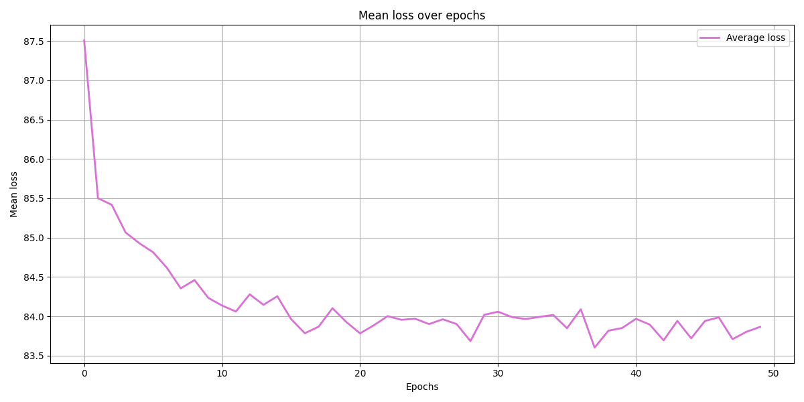
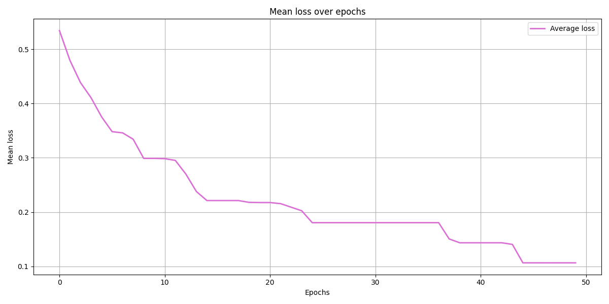

Hello, quick document to describe decisions made. 
will need to be refactored.

# TODO
- [ ] refactor / improve this doc and add it to main readme
- [ ] maybe change `load_and_predict.py` into predict.py or somthing where you can load NN weights
- [x] still has an issue of output size = batch size and predict is 3 x outputs - fix this - FIXED !!
- [x] get custom types from GA as well as target_sol. moved the files in here for convience but they really should be taken from GA source.
- [ ] spider representation in panda3d
- [ ] make curses menu

# Initial working NN 
At git commit: `60a8dce3073c4a276c082b58b9cf7bf2f73d5374`
Has batch sizes so we can train using mini batches which reduces overfitting.
Current working model using batch size of 1 so instead of mini batches we are training with SGD.
training data is not normalized and it is leading to NN getting stuck in local minimum when training.
examples of this can be seen here where the mean loss plateau's:

# new normalized training data
I believe this is because of the training data not being normalized between 0 and 1. to normalize the training data from -50 - 30, to between 0 and 1.
We will first normalize each angle in input and label data for training and testing. To do this we will get the difference between -50 and 30: which is 80. then we will + 50 to each angle and then / 80 to get the normalized result. For example angle -30 we will +50 so -30 + 50 = 20 then / 80 so 20/80 = 0.25.

once all the data is normalized and the NN is trained, we need to denormalize the predicted data. to do this we will take the normalized angle  * 80 and then -50 from it.

-50 and 30 are from the amplitude range of angles from target solution.

## results

with training data normalized it is much better

## issue
run into the problem that it always predicts the same thingg, it is probbaly because it has learnt it as the safest option, So I will try to reduce the number of hidden layers and see if that fixes it

reduced number of hidden layers to 1 64, increase period so that there is variation there

---
update it is fixed. 
also increased the number of variations which teh NN is trained on meaning different starting joints will predict different walk cycles :)

## another issue
when feeding forward, the output size is batch size x outputs
